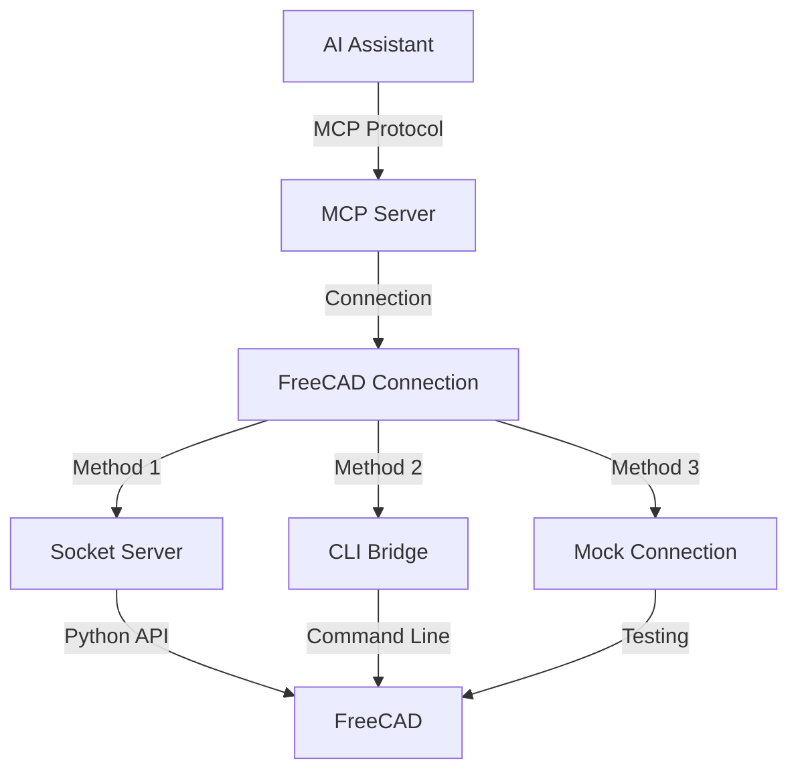

# 🛠️ MCP-FreeCAD Integration

This project provides a robust integration between AI assistants and FreeCAD CAD software using the **Model Context Protocol (MCP)**. It allows external applications to interact with FreeCAD through a standardized interface, offering multiple connection methods and specialized tools.

## 🔄 MCP Flow Chart



## 🏗️ Core Components

### 1. FreeCAD MCP Server (`freecad_mcp_server.py`)
- **Description**: The main server implementing the Model Context Protocol. It acts as the central hub for AI assistants to communicate with FreeCAD.
- **Features**:
    - Supports standard MCP requests (ListTools, ExecuteTool, ListResources, GetResource).
    - Connects to FreeCAD using various methods (see below).
    - Exposes specialized tools, including smithery operations.
    - Configurable via `mcp_config.json`.

### 2. FreeCAD Connection (`freecad_connection.py`)
- **Description**: A unified Python interface for connecting to FreeCAD, used internally by the MCP server and available for direct use.
- **Methods**:
    - **Socket Server Connection**: Communicates with a running `freecad_server.py` instance.
    - **CLI Bridge Connection**: Uses command-line calls via `freecad_bridge.py`.
    - **Mock Connection**: Provides a fallback for testing without a running FreeCAD instance.
    - **Auto Connection**: Automatically selects the best available method.

### 3. FreeCAD Server (`freecad_server.py`)
- **Description**: A standalone socket-based server script designed to run *inside* FreeCAD. It listens for commands from the `FreeCADConnection` (when using the `server` method).
- **Usage**:
    ```bash
    # Run inside FreeCAD's Python console
    exec(open("/path/to/freecad_server.py").read())

    # Or run from command line (starts FreeCAD in console mode)
    freecad -c /path/to/freecad_server.py --host localhost --port 12345 --debug
    ```

### 4. FreeCAD Bridge (`freecad_bridge.py`)
- **Description**: A Python module enabling command-line interaction with FreeCAD, bypassing direct module import issues. Used by `FreeCADConnection` when using the `bridge` method.

### 5. FreeCAD Client (`freecad_client.py`)
- **Description**: A command-line client utility for interacting directly with the `FreeCADConnection` interface (not the MCP server). Useful for basic testing and scripting outside the MCP context.
- **Example**: `python freecad_client.py create-box --length 20`

## ⚙️ Installation

1.  **Install FreeCAD**: Ensure FreeCAD is installed on your system and accessible from the command line.
2.  **Install Dependencies**:
    ```bash
    pip install modelcontextprotocol-sdk # For the MCP Server
    # Other dependencies might be listed in requirements.txt if available
    ```

## 🚀 Using the MCP Server

This is the primary way to interact with FreeCAD using AI assistants like Claude.

### Starting the MCP Server

```bash
# Start the server using the default mcp_config.json
./freecad_mcp_server.py

# Start with a specific configuration file
./freecad_mcp_server.py --config /path/to/your_config.json
```
The server will run and listen for connections from MCP clients.

### Connecting an MCP Client

Use any MCP-compatible client. Example using the reference `mcp client`:

```bash
# Replace 'mcp client' with the actual client command if different
mcp client connect stdio --command "./freecad_mcp_server.py"
```

Or using `uv` if you have a client script like the one in the MCP docs:

```bash
uv run path/to/your/mcp_client.py ./freecad_mcp_server.py
```

### MCP Server Configuration (`mcp_config.json`)

```json
{
    "server": {
        "name": "freecad-mcp-server",
        "version": "0.1.0"
    },
    "freecad": {
        "connection_method": "auto", // "auto", "server", "bridge", or "mock"
        "host": "localhost",          // For 'server' connection method
        "port": 12345,                // For 'server' connection method
        "freecad_path": "freecad"     // Path to FreeCAD executable (for 'bridge' method)
    },
    "tools": { // Optional: control which tool groups are enabled
        "enable_smithery": true,
        "enable_primitives": true,
        "enable_model_manipulation": true,
        "enable_export_import": true
    }
}
```

## 🛠️ Available MCP Tools

The MCP server exposes various tools. Here are some highlights:

### 🔨 Smithery Tools (`smithery.*`)
- Specialized tools for blacksmithing and metalwork design:
    - `smithery.create_anvil`: Generate an anvil model.
    - `smithery.create_hammer`: Generate a blacksmith hammer.
    - `smithery.create_tongs`: Generate blacksmith tongs.
    - `smithery.forge_blade`: Create knife/sword blade models.
    - `smithery.create_horseshoe`: Create a horseshoe model.

### 📐 Basic FreeCAD Tools (`freecad.*`)
- `freecad.create_document`: Create a new document.
- `freecad.export_stl`: Export the model or specific objects to STL.
- *(Other tools like primitive creation, manipulation etc., might be available if enabled in config and implemented)*

## 📝 Example MCP Interactions

Here are conceptual examples of using the MCP server with an AI assistant:

### Creating an Anvil

```
User: Can you create a blacksmith anvil model in FreeCAD?

Assistant: Okay, I can do that. I'll use the `smithery.create_anvil` tool.
[Tool Call: smithery.create_anvil]
[Tool Result: {"anvil_id": "Anvil", "message": "Created anvil...", "success": true}]

Assistant: I've created the anvil model in FreeCAD. It has the default dimensions. Would you like to customize it or export it?
```

### Creating a Hammer

```
User: Make me a blacksmith hammer with a 400mm handle.

Assistant: Sure, I can create a hammer with a longer handle.
[Tool Call: smithery.create_hammer (arguments: {"handle_length": 400.0})]
[Tool Result: {"hammer_id": "Hammer", "message": "Created hammer...", "success": true}]

Assistant: I've created the hammer with a 400mm handle and default head dimensions.
```

## 🔍 Troubleshooting

- **MCP Server Connection Issues**: Ensure the `freecad_mcp_server.py` script is running and executable. Check firewall settings if connecting remotely (though stdio is typical for local use).
- **FreeCAD Connection Issues**:
    - **`auto` or `bridge` method**: Verify FreeCAD is installed and the `freecad` command works in your terminal. Check the `freecad_path` in `mcp_config.json`.
    - **`server` method**: Ensure `freecad_server.py` is running inside an active FreeCAD instance, listening on the correct host/port configured in `mcp_config.json`.
    - **General**: Check FreeCAD logs for errors.
- **Missing MCP SDK**: Install via `pip install modelcontextprotocol-sdk`.
- **Python Path Issues**: If FreeCAD modules aren't found, ensure FreeCAD's `lib` directory is in your `PYTHONPATH` environment variable, especially when running scripts directly.

## 📄 License

This project is licensed under the MIT License - see the LICENSE file for details.
