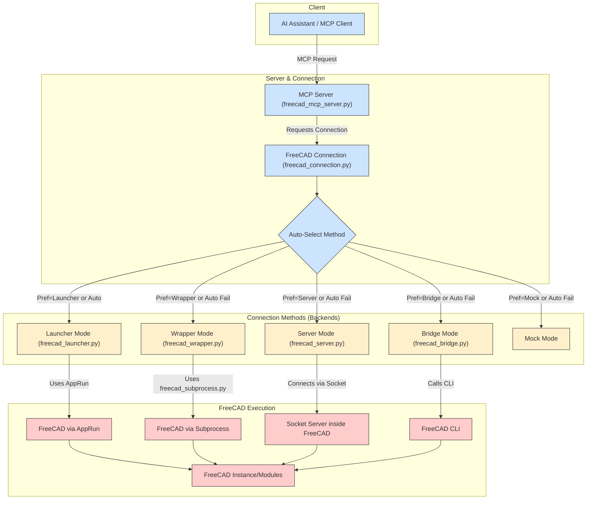

# 🛠️ MCP-FreeCAD Integration

> **Note:** This repository is under heavy development. Expect daily commits and potential breaking changes.

[](https://opensource.org/licenses/MIT)
[](https://www.python.org/)
[](https://flake8.pycqa.org/en/latest/)
[]()

This project provides a robust integration between AI assistants and FreeCAD CAD software using the **Model Context Protocol (MCP)**. It allows external applications to interact with FreeCAD through a standardized interface, offering multiple connection methods and specialized tools.

## 🔄 MCP Flow Chart



This flowchart shows the main components and how different connection methods selected by `freecad_connection.py` lead to various ways of executing commands within FreeCAD. The `launcher` method, often used with extracted AppImages via `AppRun`, is the recommended approach for reliability.

For more detailed flowcharts, see [FLOWCHART.md](docs/FLOWCHART.md).

## 🔄 Core Components

### 1. FreeCAD MCP Server (`freecad_mcp_server.py`)
- **Description**: The main server implementing the Model Context Protocol. It acts as the central hub for AI assistants to communicate with FreeCAD.
- **Features**:
    - Supports standard MCP requests (ListTools, ExecuteTool, ListResources, GetResource).
    - Connects to FreeCAD using various methods (see below).
    - Exposes specialized tools, including smithery operations.
    - Configurable via `config.json`.

### 2. FreeCAD Connection (`freecad_connection.py`)
- **Description**: A unified Python interface for connecting to FreeCAD, used internally by the MCP server and available for direct use. It intelligently selects the best connection method based on configuration and availability.
- **Methods**:
    - **Launcher Connection**: (Recommended with AppImage) Uses `freecad_launcher.py` to start FreeCAD via `AppRun` from an extracted AppImage. Ensures a clean environment.
    - **Wrapper Connection**: Uses `freecad_wrapper.py` to run FreeCAD logic in a separate Python subprocess, communicating via pipes.
    - **Socket Server Connection**: Communicates with a running `freecad_server.py` instance via sockets.
    - **CLI Bridge Connection**: Uses command-line calls via `freecad_bridge.py`. Can be less reliable for complex operations.
    - **Mock Connection**: Provides a fallback for testing without a running FreeCAD instance.
    - **Auto Connection**: Automatically selects the best available method (default order: launcher, wrapper, server, bridge, mock).

### 3. FreeCAD Launcher (`freecad_launcher.py`)
- **Description**: A script responsible for launching the FreeCAD environment, typically using `AppRun` from an extracted AppImage when configured for the `launcher` connection method. It passes commands to `freecad_script.py` running inside the launched FreeCAD environment.

### 4. FreeCAD Wrapper (`freecad_wrapper.py`) & Subprocess (`freecad_subprocess.py`)
- **Description**: The `freecad_wrapper.py` starts `freecad_subprocess.py` in a clean Python process. `freecad_subprocess.py` imports FreeCAD modules and executes commands received via standard input/output from the wrapper. Used by the `wrapper` connection method.

### 5. FreeCAD Server (`freecad_server.py`)
- **Description**: A standalone socket-based server script designed to run *inside* FreeCAD. It listens for commands from the `FreeCADConnection` (when using the `server` method). Requires manual setup within FreeCAD or specific launch parameters.
- **Usage**:
    ```bash
    # Run inside FreeCAD's Python console
    exec(open("/path/to/freecad_server.py").read())

    # Or run from command line (starts FreeCAD in console mode)
    freecad -c /path/to/freecad_server.py --host localhost --port 12345 --debug
    ```
See [FREECAD_SERVER_SETUP.md](docs/FREECAD_SERVER_SETUP.md) for detailed setup instructions.

### 6. FreeCAD Bridge (`freecad_bridge.py`)
- **Description**: A Python module enabling command-line interaction with FreeCAD, bypassing direct module import issues. Used by `FreeCADConnection` when using the `bridge` method. Less commonly used now compared to `launcher` or `wrapper`.

### 7. FreeCAD Client (`freecad_client.py`)
- **Description**: A command-line client utility for interacting directly with the `FreeCADConnection` interface (not the MCP server). Useful for basic testing and scripting outside the MCP context.
- **Example**: `python freecad_client.py create-box --length 20`

## 🔄 Project Structure

The MCP-FreeCAD project is organized with the following directory structure:

```
mcp-freecad/
├── assets/                  # 3D model assets (STL, STEP files)
├── backups/                 # Backup files
├── config.json              # Main configuration file
├── docs/                    # Documentation files
│   ├── FLOWCHART.md         # Detailed flow diagrams
│   ├── FREECAD_INTEGRATION.md # FreeCAD integration guide
│   ├── FREECAD_SERVER_SETUP.md # Server setup instructions
│   ├── OPTIMIZATION_FEATURES.md # Performance optimization guide
│   └── PYTHON_INTERPRETER_SETUP.md # Python interpreter configuration
├── examples/                # Example scripts showing API usage
├── freecad_bridge.py        # Bridge for CLI interaction with FreeCAD
├── freecad_client.py        # Command-line client
├── freecad_connection.py    # Unified connection interface
├── freecad_mcp.py           # Entry point script
├── freecad_mcp_server.py    # MCP server implementation
├── freecad_server.py        # Socket-based server for FreeCAD
├── scripts/                 # Shell scripts for installation and execution
│   ├── README.md            # Scripts documentation
│   ├── bin/                 # Executable scripts
│   │   ├── install-global.sh    # Global installation script
│   │   ├── mcp-freecad-installer.sh # Installer script
│   │   ├── mcp-freecad.sh       # Simple wrapper script
│   │   └── run-freecad-server.sh # Server runner script
│   ├── start_freecad_with_server.sh # FreeCAD starter with server
│   └── start_server.py       # Python script for server startup
├── src/                     # Source code
├── tests/                   # Test files
└── tmp/                     # Temporary files
```

For more details on scripts, see [scripts/README.md](scripts/README.md).

## ⚙️ Installation

There are several ways to install and use the MCP-FreeCAD server:

### 1. Quick Start for AI Tools

To install and run the MCP-FreeCAD server in a single command, run:

```bash
curl -sSL https://raw.githubusercontent.com/jango-blockchained/mcp-freecad/main/scripts/bin/mcp-freecad-installer.sh | bash
```

This command will:
1. Clone the MCP-FreeCAD repository (or update it if already cloned)
2. Set up a Python virtual environment
3. Install all dependencies
4. Start the MCP server

After installation, you can run the server directly with:

```bash
~/.mcp-freecad/scripts/bin/mcp-freecad.sh
```

### 2. Global Installation

If you have cloned the repository, you can install the MCP-FreeCAD server globally on your system:

```bash
# Navigate to the repository
cd /path/to/mcp-freecad

# Run the global installation script
./scripts/bin/install-global.sh
```

After installation, you can run the server from anywhere with:

```bash
mcp-freecad
```

### 3. Manual Installation

You can also install the server manually:

```bash
# Clone the repository
git clone https://github.com/jango-blockchained/mcp-freecad.git
cd mcp-freecad

# Create a virtual environment
python -m venv .venv
source .venv/bin/activate  # On Windows: .venv\Scripts\activate

# Install dependencies
pip install -r requirements.txt

# Install the package in development mode
pip install -e .

# Run the server
python freecad_mcp_server.py
```

### 4. Recommended Setup: Using FreeCAD AppImage (Most Reliable)

For the most reliable FreeCAD connection, especially if you encounter module import issues or environment conflicts, we strongly recommend using an extracted FreeCAD AppImage with the `launcher` connection method:

1.  **Download a FreeCAD AppImage**: Get the latest stable or weekly build AppImage (e.g., `.AppImage` format) from the [FreeCAD releases page](https://github.com/FreeCAD/FreeCAD/releases).

2.  **Make it Executable**: `chmod +x /path/to/FreeCAD_*.AppImage`

3.  **Extract the AppImage**: Use the provided utility script `extract_appimage.py` from the root of this repository. This creates a self-contained FreeCAD environment directory (`squashfs-root`).

    ```bash
    # Navigate to the mcp-freecad directory
    cd /path/to/mcp-freecad

    # Run the extraction script, providing the path to your downloaded AppImage
    python extract_appimage.py /path/to/FreeCAD_*.AppImage

    # Optional: Specify output directory (defaults to creating squashfs-root in the current dir)
    # python extract_appimage.py /path/to/FreeCAD_*.AppImage --output ./my_freecad_appimage
    ```
    This script will:
    - Extract the AppImage contents to a `squashfs-root` directory.
    - **Automatically update your `config.json`** to use the `launcher` method and set the correct paths (`path`, `script_path`, `launcher_path`, `apprun_path`, `use_apprun: true`).
    - Test the extracted AppImage to ensure it works.

4.  **Start the MCP Server**: The server will now use the `launcher` connection method configured in `config.json` to run FreeCAD operations within the clean, extracted AppImage environment.

    ```bash
    python freecad_mcp_server.py
    ```

This method avoids potential conflicts with system Python versions and ensures all necessary FreeCAD dependencies and modules are correctly loaded via `AppRun`.

### 5. FreeCAD Python Interpreter Setup

For proper integration with FreeCAD's Python modules, see [PYTHON_INTERPRETER_SETUP.md](docs/PYTHON_INTERPRETER_SETUP.md) which explains how to:

- Extract and use FreeCAD's AppImage Python interpreter
- Set up a virtual environment with FreeCAD's Python
- Configure `PYTHONPATH` for FreeCAD module access

## 🚀 Using the MCP Server

This is the primary way to interact with FreeCAD using AI assistants like Claude.

### Starting the MCP Server

```bash
# Start the server using the default config.json
python freecad_mcp_server.py

# Start with a specific configuration file
python freecad_mcp_server.py --config /path/to/your/config.json

# Enable debug logging
python freecad_mcp_server.py --debug
```
The server will run and listen for connections from MCP clients.

### Connecting an MCP Client

Use any MCP-compatible client. Example using the reference `mcp client`:

```bash
# Replace 'mcp client' with the actual client command if different
mcp client connect stdio --command "python freecad_mcp_server.py"
```

Or using `uv` if you have a client script like the one in the MCP docs:

```bash
uv run path/to/your/mcp_client.py python freecad_mcp_server.py
```

### Alternative: Starting FreeCAD with Integrated Server

You can also start FreeCAD with the integrated server using:

```bash
./scripts/start_freecad_with_server.sh
```

This will launch FreeCAD and automatically start the server inside it.

### MCP Server Configuration (`config.json`)

The `config.json` file controls various aspects of the server. Here is an example reflecting the recommended **launcher setup** after running `extract_appimage.py`:

```json
{
  "auth": { // Optional authentication settings
    "api_key": "development",
    "enabled": false
  },
  "server": { // MCP server settings
    "host": "0.0.0.0",
    "port": 8000,
    "debug": true,
    "workers": 1,
    "name": "mcp-freecad",
    "version": "0.3.1", // Example version
    "mcp": {
      "transport": "stdio", // Use stdio for Cursor/local clients
      "protocol_version": "0.1.0"
      // ... other MCP settings
    }
  },
  "freecad": { // FreeCAD connection settings
    // Paths are set automatically by extract_appimage.py for launcher mode
    "path": "/home/user/mcp-freecad/squashfs-root/usr/bin/freecad", // Example path
    "python_path": "/home/user/mcp-freecad/squashfs-root/usr/bin/python", // Example path
    "module_path": "/home/user/mcp-freecad/squashfs-root/usr/lib/", // Example path
    "host": "localhost", // Not used by launcher
    "port": 12345, // Not used by launcher
    "auto_connect": false, // Connection handled internally
    "reconnect_on_failure": true,
    "use_mock": false,
    "connection_method": "launcher", // *** KEY: Use the launcher method ***
    "script_path": "/home/user/mcp-freecad/freecad_script.py", // Script run inside FreeCAD
    "launcher_path": "/home/user/mcp-freecad/freecad_launcher.py", // Script that starts AppRun
    "use_apprun": true, // *** KEY: Tells launcher to use AppRun ***
    "apprun_path": "/home/user/mcp-freecad/squashfs-root/AppRun" // Path to AppRun executable
  },
  "logging": { // Logging configuration
    "level": "INFO",
    "file": "mcp_freecad.log",
    "max_size": 10485760,
    "backup_count": 3
  },
  "tools": { // Optional: control which tool groups are enabled
    "enable_smithery": true,
    "enable_primitives": true,
    "enable_model_manipulation": true,
    "enable_export_import": true,
    "enable_measurement": true,
    "enable_code_generator": true
    // ... other tool settings
  }
  // ... other sections like cache, recovery, cors, performance ...
}
```
*Note: Replace example paths with your actual absolute paths.*

See [FREECAD_INTEGRATION.md](docs/FREECAD_INTEGRATION.md) for more details on integration options.

## 🛠️ Available MCP Tools

The MCP server exposes various tool groups. Here are all available tools:

### 📐 Basic FreeCAD Tools (`freecad.*`)
- `freecad.create_document`: Create a new document
- `freecad.export_stl`: Export the model or specific objects to STL
- `freecad.import_stl`: Import STL files into the current document
- `freecad.save_document`: Save the current document
- `freecad.load_document`: Load an existing document

### 🔧 Model Manipulation Tools (`model_manipulation.*`)
- `model_manipulation.rotate`: Rotate objects around specified axes
- `model_manipulation.translate`: Move objects in 3D space
- `model_manipulation.scale`: Scale objects uniformly or non-uniformly
- `model_manipulation.mirror`: Mirror objects across specified planes
- `model_manipulation.union`: Combine multiple objects using boolean union
- `model_manipulation.cut`: Cut objects using boolean difference
- `model_manipulation.intersect`: Create intersection of multiple objects

### 📏 Measurement Tools (`measurement.*`)
- `measurement.distance`: Measure distance between two points
- `measurement.angle`: Measure angle between three points
- `measurement.area`: Calculate surface area of objects
- `measurement.volume`: Calculate volume of solid objects
- `measurement.mass`: Calculate mass of objects (requires material properties)

### 📦 Primitives Tools (`primitives.*`)
- `primitives.create_box`: Create a rectangular box
- `primitives.create_cylinder`: Create a cylinder
- `primitives.create_sphere`: Create a sphere
- `primitives.create_cone`: Create a cone
- `primitives.create_torus`: Create a torus
- `primitives.create_polygon`: Create a regular polygon
- `primitives.create_ellipse`: Create an ellipse

### 🔄 Export/Import Tools (`export_import.*`)
- `export_import.export_step`: Export to STEP format
- `export_import.import_step`: Import from STEP format
- `export_import.export_iges`: Export to IGES format
- `export_import.import_iges`: Import from IGES format
- `export_import.export_dxf`: Export to DXF format
- `export_import.import_dxf`: Import from DXF format

### 💻 Code Generation Tools (`code_generator.*`)
- `code_generator.generate_python`: Generate Python code for the current model
- `code_generator.generate_openscad`: Generate OpenSCAD code for the current model
- `code_generator.generate_gcode`: Generate G-code for CNC machining
- `code_generator.generate_3d_print`: Generate optimized 3D printing settings

## 📝 Example MCP Interactions

Here are conceptual examples of using the MCP server with an AI assistant:

### Creating and Exporting a Box

```
User: Create a box 50mm long, 30mm wide, and 20mm high.

Assistant: Okay, I can create that box.
[Tool Call: primitives.create_box (arguments: {"length": 50.0, "width": 30.0, "height": 20.0})]
[Tool Result: {"object_name": "Box", "message": "Created box...", "success": true}]

User: Now export it as box.stl

Assistant: Sure, exporting the model to box.stl.
[Tool Call: export_import.export_stl (arguments: {"file_path": "box.stl", "object_names": ["Box"]})]
[Tool Result: {"file_path": "box.stl", "message": "Exported successfully...", "success": true}]

Assistant: I've exported the box model to `box.stl`.
```

## 🔍 Troubleshooting

- **MCP Server Connection Issues**:
    - Ensure `python freecad_mcp_server.py` can run without immediate errors. Check terminal output.
    - Check firewall settings if relevant (unlikely for `stdio`).
    - Verify `config.json` is valid JSON.
- **FreeCAD Connection Issues (Especially with `launcher` method)**:
    - **Run `extract_appimage.py`**: Ensure the AppImage was extracted correctly and `config.json` was updated.
    - **Check `config.json` Paths**: Verify all absolute paths in the `freecad` section are correct for your system.
    - **Check Permissions**: Ensure `squashfs-root/AppRun` has execute permissions (`chmod +x`).
    - **Check Logs**: Examine `mcp_freecad.log` (created in the project root if logging starts), `freecad_server_stdout.log`, and `freecad_server_stderr.log` for errors from `freecad_launcher.py`, `AppRun`, or the FreeCAD process itself.
    - **Environment Variables**: If `AppRun` fails to find libraries, ensure `LD_LIBRARY_PATH` and `PYTHONPATH` are correctly set, potentially within `.cursor/mcp.json` if using Cursor, or exported manually if testing in the terminal. The `extract_appimage.py` script aims to make this less necessary, but it can be a factor.
    - **Headless Issues**: Sometimes FreeCAD has issues running completely headless (`QT_QPA_PLATFORM=offscreen`). Check logs for GUI-related errors.
- **`server` method**: Ensure `freecad_server.py` is running inside an active FreeCAD instance, listening on the correct host/port configured in `config.json`.
- **`bridge` method**: Verify FreeCAD is installed system-wide and the `freecad` command works in your terminal. Check the `freecad_path` in `config.json`.
- **Missing MCP SDK**: Install via `pip install modelcontextprotocol`.
- **Python Path Issues**: If FreeCAD modules aren't found when *not* using the recommended AppImage setup, refer to [PYTHON_INTERPRETER_SETUP.md](docs/PYTHON_INTERPRETER_SETUP.md).

## 📄 License

This project is licensed under the MIT License - see the LICENSE file for details.

## 🖥️ Cursor Integration

The MCP server is designed for integration with tools like Cursor IDE.

1.  **Configure Cursor**: Add the MCP server in Cursor's settings (Settings > Features > MCP Servers > Add New MCP Server). Configure it to run the Python script directly, setting the necessary environment variables and working directory. An example configuration in `.cursor/mcp.json` would look like this:
    ```json
    {
        "mcpServers": {
          "mcp-freecad": {
            "command": "python3", // Command to run python
            "args": [
              "freecad_mcp_server.py" // Script to run
            ],
            "env": { // Environment variables needed for headless AppRun
               "QT_QPA_PLATFORM": "offscreen",
               "DISPLAY": "",
               "FREECAD_CONSOLE": "1",
               "PYTHONNOUSERSITE": "1",
               // These might be needed if AppRun doesn't set them automatically
               "LD_LIBRARY_PATH": "/path/to/mcp-freecad/squashfs-root/usr/lib:/path/to/mcp-freecad/squashfs-root/usr/Ext:...",
               "PYTHONPATH": "/path/to/mcp-freecad/squashfs-root/usr/lib/python3.11/site-packages:..."
            },
            "cwd": "/path/to/mcp-freecad" // Set working directory to project root
          }
          // ... other servers like memory ...
        }
    }
    ```
    *Replace `/path/to/mcp-freecad` with the actual absolute path to your project.*
    *Ensure the `LD_LIBRARY_PATH` and `PYTHONPATH` match your AppImage structure if needed.*

2.  **Restart Cursor**: Fully restart Cursor for the configuration changes to take effect.

3.  **Server Communication**: The server uses `stdio` transport by default (configured in `config.json` under `server.mcp.transport`), which is compatible with Cursor's communication protocol. Errors should be reported back to Cursor via MCP error responses.

### Cursor-Specific Considerations
- The `freecad_mcp_server.py` script loads `config.json` by default. Ensure this file contains the correct settings, especially the `freecad` section updated by `extract_appimage.py`.
- The environment variables set in `.cursor/mcp.json` are crucial for allowing the `launcher` method to work correctly within the environment Cursor provides.

## 📋 Available Options and Use Cases

### 🔧 Connection Methods
1.  **Launcher Connection (Recommended)**
    - Uses `AppRun` from an extracted AppImage. Most reliable.
    - Configured automatically by `extract_appimage.py`.
    - Configuration (`config.json`):
    ```json
    { "freecad": { "connection_method": "launcher", "use_apprun": true, "apprun_path": "/path/to/squashfs-root/AppRun", ... } }
    ```
2.  **Wrapper Connection**
    - Runs FreeCAD logic in a separate Python subprocess. Good alternative if AppImage/AppRun causes issues.
    - Configuration (`config.json`):
    ```json
    { "freecad": { "connection_method": "wrapper", ... } }
    ```
3.  **Socket Server Connection**
    - Requires running `freecad_server.py` inside FreeCAD.
    - Use when running FreeCAD as a persistent background server.
    - Configuration (`config.json`):
    ```json
    { "freecad": { "connection_method": "server", "host": "localhost", "port": 12345, ... } }
    ```
4.  **CLI Bridge Connection**
    - Uses the `freecad` command-line tool. Can be slower/less reliable.
    - Configuration (`config.json`):
    ```json
    { "freecad": { "connection_method": "bridge", "freecad_path": "/path/to/system/freecad", ... } }
    ```
5.  **Mock Connection**
    - For testing without FreeCAD.
    - Configuration (`config.json`):
    ```json
    { "freecad": { "connection_method": "mock", "use_mock": true } }
    ```
6.  **Auto Connection**
    - Automatically selects the best available method (launcher > wrapper > server > bridge > mock).
    - Default if `connection_method` is missing or set to `"auto"`.

### 🛠️ Tool Categories and Use Cases

1. **Basic FreeCAD Operations**
   - Essential document management
   - Use cases:
     * Creating new documents
     * Saving and loading projects
     * Exporting to various formats
     * Managing document structure

2. **Model Manipulation**
   - Transforming and modifying objects
   - Use cases:
     * Rotating objects precisely
     * Moving objects in 3D space
     * Scaling models
     * Creating mirrors and copies
     * Boolean operations (union, cut, intersect)

3. **Measurement Tools**
   - Analysis and verification
   - Use cases:
     * Distance measurements
     * Angle calculations
     * Surface area analysis
     * Volume calculations
     * Mass properties

4. **Primitive Creation**
   - Basic shape generation
   - Use cases:
     * Creating boxes and cylinders
     * Generating spheres
     * Making cones and tori
     * Creating regular polygons
     * Drawing ellipses

5. **Export/Import Operations**
   - File format conversion
   - Use cases:
     * STEP file export/import
     * IGES format handling
     * DXF file processing
     * STL export for 3D printing

6. **Code Generation**
   - Automated code creation
   - Use cases:
     * Python script generation
     * OpenSCAD code export
     * G-code generation for CNC
     * 3D printer settings optimization

### 💻 Integration Scenarios

1. **Cursor IDE Integration**
   - Development environment integration
   - Use cases:
     * Direct model manipulation from IDE
     * Real-time feedback
     * Debug logging
     * Error tracking

2. **AI Assistant Integration**
   - AI-powered design automation
   - Use cases:
     * Natural language model creation
     * Automated design modifications
     * Parameter optimization
     * Design validation

3. **Command Line Usage**
   - Scripting and automation
   - Use cases:
     * Batch processing
     * Automated testing
     * CI/CD integration
     * Command-line tools

### 🎯 Common Use Case Examples

1. **Rapid Prototyping**
```python
# Create a new document
freecad.create_document("Prototype")
# Add basic shapes
primitives.create_box(length=100, width=50, height=20)
# Export for 3D printing
export_import.export_stl("prototype.stl")
```

2. **Automated Processing**
```python
# Import and modify multiple files
for file in files:
    import_step(file)
    model_manipulation.scale(1.5)
    export_stl(f"{file}_scaled.stl")
```

### ⚙️ Configuration Options

1. **Server Configuration**
```json
{
    "server": {
        "name": "custom-server-name",
        "version": "1.0.0",
        "description": "Custom description"
    }
}
```

2. **Tool Enablement**
```json
{
    "tools": {
        "enable_smithery": true,
        "enable_primitives": true,
        "enable_model_manipulation": true,
        "enable_export_import": true,
        "enable_measurement": true,
        "enable_code_generator": true
    }
}
```

3. **Debug Configuration**
```json
{
    "cursor": {
        "debug": true,
        "log_level": "DEBUG",
        "stdio_transport": true
    }
}
```

## Features

- Connect AI assistants to FreeCAD through the MCP protocol
- Create and manipulate 3D models programmatically
- Support for primitive shapes (box, cylinder, sphere, cone)
- Boolean operations (union, intersection, cut)
- Object transformations (move, rotate)
- Export models to STL format
- Document and object management

## Prerequisites

- Python 3.8 or newer
- MCP SDK (`pip install modelcontextprotocol`)
- **Recommended**: A FreeCAD AppImage (downloaded and extracted using `extract_appimage.py`) for the reliable `launcher` connection method.
- **Alternatively**: A system installation of FreeCAD 0.20+ (for `bridge` or `server` methods, potentially less reliable).

## Available Tools

### Document Management

1. **freecad.create_document** - Create a new FreeCAD document
2. **freecad.list_documents** - List all open documents
3. **freecad.list_objects** - List all objects in a document

### 3D Primitives

1. **freecad.create_box** - Create a box primitive
2. **freecad.create_cylinder** - Create a cylinder primitive
3. **freecad.create_sphere** - Create a sphere primitive
4. **freecad.create_cone** - Create a cone primitive

### Boolean Operations

1. **freecad.boolean_union** - Create a union of two objects (add)
2. **freecad.boolean_cut** - Cut the second object from the first (subtract)
3. **freecad.boolean_intersection** - Create the intersection of two objects (common volume)

### Transformations

1. **freecad.move_object** - Move an object to a new position
2. **freecad.rotate_object** - Rotate an object

### Export

1. **freecad.export_stl** - Export the model to an STL file

## Testing

The project includes both unit tests and end-to-end (E2E) tests to ensure quality and reliability.

### Unit Tests

To run the basic unit tests:

```bash
python test_mcp_tools.py
python test_mcp_client.py
```

### End-to-End Tests

End-to-end tests verify that the entire system works correctly from the client's perspective. They test real-world scenarios and interactions between different components.

To run all E2E tests:

```bash
# Run with mock FreeCAD (default, doesn't require actual FreeCAD installation)
./tests/e2e/run_tests.py

# Run with verbose output
./tests/e2e/run_tests.py --verbose

# Run with real FreeCAD connection (requires FreeCAD to be installed)
./tests/e2e/run_tests.py --real

# Run a specific test file
./tests/e2e/run_tests.py --single test_primitives.py
```

The E2E tests are organized by functionality:
- `test_primitives.py` - Tests for basic shape creation and manipulation
- `test_smithery.py` - Tests for blacksmithing tool operations

#### Writing New E2E Tests

To add new E2E tests:

1. Create a new test file in the `tests/e2e/` directory
2. Extend the appropriate base test class (`MCPClientTestBase`)
3. Add test methods that use the MCP client to interact with the tools
4. Run your tests with the test runner

See existing test files for examples.

## Documentation

The project includes several documentation files for different aspects:

- [PYTHON_INTERPRETER_SETUP.md](docs/PYTHON_INTERPRETER_SETUP.md) - How to configure the Python interpreter
- [FREECAD_SERVER_SETUP.md](docs/FREECAD_SERVER_SETUP.md) - Server setup guide
- [FREECAD_INTEGRATION.md](docs/FREECAD_INTEGRATION.md) - FreeCAD integration methods
- [FLOWCHART.md](docs/FLOWCHART.md) - Detailed flow diagrams
- [OPTIMIZATION_FEATURES.md](docs/OPTIMIZATION_FEATURES.md) - Performance optimization guide
- [scripts/README.md](scripts/README.md) - Scripts documentation

For AI assistants, please refer to the [AI_ASSISTANT_GUIDE.md](AI_ASSISTANT_GUIDE.md) for detailed usage instructions and examples.

## Contributing

Contributions are welcome! Please feel free to submit a Pull Request.

## Acknowledgments

- FreeCAD development team for the amazing CAD software
- Anthropic and Claude for the Model Context Protocol (MCP) SDK
