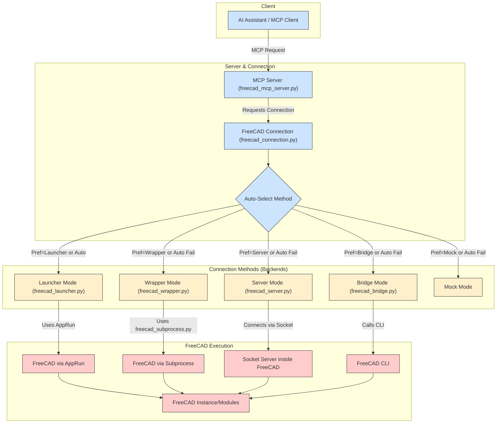

# 🛠️ MCP-FreeCAD Integration

> **Note:** This repository is under heavy development. Expect daily commits and potential breaking changes.

[](https://opensource.org/licenses/MIT)
[](https://www.python.org/)
[](https://flake8.pycqa.org/en/latest/)
[]()

This project provides a robust integration between AI assistants and FreeCAD CAD software using the **Model Context Protocol (MCP)**. It allows external applications to interact with FreeCAD through a standardized interface, offering multiple connection methods and specialized tools.

## Quick Start (Recommended: AppImage + Launcher)

For the most reliable setup, follow these steps:

1.  **Setup Environment (One-time)**: Run the setup script. This clones the repository to `~/.mcp-freecad`, creates a Python virtual environment, downloads the latest stable FreeCAD AppImage, extracts it, and configures the server to use it.
    ```bash
    curl -sSL https://raw.githubusercontent.com/jango-blockchained/mcp-freecad/main/scripts/bin/setup_freecad_env.sh | bash
    ```
    *Alternatively, clone the repo and run `./scripts/bin/setup_freecad_env.sh` manually.*

2.  **Run the MCP Server**: Use the installer script (which now just ensures the venv is active and runs the server) or the global command if installed.
    ```bash
    # Option A: Run via the installer script in the default location
    ~/.mcp-freecad/scripts/bin/mcp-freecad-installer.sh

    # Option B: Run the global command (if installed via install-global.sh)
    mcp-freecad
    ```

This starts the MCP server using the recommended `launcher` method with the downloaded and extracted AppImage.

## Docker Support

You can also run MCP-FreeCAD in a Docker container for easier deployment and isolation.

### Running with Docker Compose

1. **Start the container**:
   ```bash
   docker compose up
   ```

2. **Build from scratch** (if you've made changes):
   ```bash
   docker compose build --no-cache
   docker compose up
   ```

The Docker container exposes the following ports:
- 8080: MCP server
- 12345: FreeCAD server

### Docker Configuration

The Docker setup consists of:
- `Dockerfile`: Defines the container with Python 3.12, installs dependencies, and sets up the environment
- `docker-compose.yml`: Configures the service, ports, volumes, and restart policies
- `.dockerignore`: Excludes unnecessary files from the container

This approach is especially useful for CI/CD pipelines or when you need to isolate the MCP-FreeCAD environment from your system.

## 🔄 MCP Flow Chart



This flowchart shows the main components and how different connection methods selected by `freecad_connection.py` lead to various ways of executing commands within FreeCAD. The `launcher` method, often used with extracted AppImages via `AppRun`, is the recommended approach for reliability.

For more detailed flowcharts, see [FLOWCHART.md](docs/FLOWCHART.md).

## 🔄 Core Components

### 1. FreeCAD MCP Server (`freecad_mcp_server.py`)
- **Description**: The main server implementing the Model Context Protocol. It acts as the central hub for AI assistants or other clients to communicate with FreeCAD via MCP.
- **Features**:
    - Handles standard MCP requests (`mcp/listTools`, `mcp/executeTool`).
    - Utilizes `FreeCADConnection` to interact with FreeCAD using the configured method.
    - Exposes various toolsets (primitives, manipulation, export, etc.) based on configuration.
    - Configurable via `config.json`.
- **Usage**:
    ```bash
    # Start the server (uses config.json by default)
    python src/mcp_freecad/server/freecad_mcp_server.py

    # Start with a specific config
    python src/mcp_freecad/server/freecad_mcp_server.py --config my_config.json
    ```

### 2. FreeCAD Connection (`freecad_connection.py`)
- **Description**: A unified Python interface encapsulating the logic for connecting to FreeCAD. Used internally by the MCP server and available for direct scripting.
- **Features**:
    - Intelligently selects the best connection method based on configuration and availability.
- **Methods**:
    - **Launcher**: (Recommended) Uses `freecad_launcher.py` and `AppRun`.
    - **Wrapper**: Uses `freecad_wrapper.py` and `freecad_subprocess.py`.
    - **Server**: Connects to a running `freecad_server.py` via sockets.
    - **Bridge**: Uses the FreeCAD CLI via `freecad_bridge.py`.
    - **Mock**: Simulates FreeCAD for testing.
    - **Auto**: Tries methods in recommended order (launcher > wrapper > server > bridge > mock).
- **Usage (Direct Scripting Example)**:
    ```python
    from freecad_connection import FreeCADConnection

    # Auto-connect using settings potentially from config.json
    # (Ensure config.json is present or provide args)
    fc = FreeCADConnection(auto_connect=True)

    if fc.is_connected():
        print(f"Connected via: {fc.get_connection_type()}")
        version_info = fc.get_version()
        print(f"FreeCAD Version: {version_info}")
        fc.create_document("TestDocFromScript")
    else:
        print("Failed to connect to FreeCAD.")
    ```

### 3. FreeCAD Launcher (`freecad_launcher.py`)
- **Description**: Handles launching the FreeCAD environment, typically using `AppRun` from an extracted AppImage. It executes `freecad_script.py` within the launched environment.
- **Features**:
    - Manages the subprocess execution of FreeCAD/AppRun.
    - Passes commands and parameters to the internal FreeCAD script.
    - Parses JSON results from the script's output.
- **Usage**: Primarily used internally by `FreeCADConnection` when the `launcher` method is selected (configured in `config.json`). Not typically run directly by the user.

### 4. FreeCAD Wrapper (`freecad_wrapper.py`) & Subprocess (`freecad_subprocess.py`)
- **Description**: The `freecad_wrapper.py` starts `freecad_subprocess.py` in a separate Python process. `freecad_subprocess.py` imports FreeCAD modules and communicates with the wrapper via stdio pipes.
- **Features**:
    - Isolates FreeCAD module imports into a dedicated process.
    - Provides an alternative connection method if direct module imports are feasible but AppRun/launcher is problematic.
- **Usage**: Used internally by `FreeCADConnection` when the `wrapper` method is selected (configured in `config.json`). Requires a Python environment where the subprocess can successfully `import FreeCAD`.

### 5. FreeCAD Server (`freecad_server.py`)
- **Description**: A standalone socket server designed to run *inside* a FreeCAD instance. Listens for connections from `FreeCADConnection`.
- **Features**:
    - Allows connection to a potentially persistent FreeCAD instance.
    - Can interact with the GUI if run in `--connect` mode.
- **Usage (Manual Start within FreeCAD)**:
    ```python
    # Inside FreeCAD Python Console:
    exec(open("/path/to/mcp-freecad/freecad_server.py").read())
    ```
    *Requires `connection_method: server` in `config.json` for the MCP Server to connect.* (See `docs/FREECAD_SERVER_SETUP.md`)

### 6. FreeCAD Bridge (`freecad_bridge.py`)
- **Description**: Enables command-line interaction with the FreeCAD executable. Bypasses direct module import issues but can be slower.
- **Features**:
    - Executes FreeCAD commands via subprocess calls to the `freecad` executable.
- **Usage**: Used internally by `FreeCADConnection` when the `bridge` method is selected (configured in `config.json`). Requires `freecad` to be in the system PATH or the `path` correctly set in config.

### 7. FreeCAD Client (`freecad_client.py`)
- **Description**: A command-line utility for interacting directly with the `FreeCADConnection` interface (for testing/debugging connection methods, not the MCP server).
- **Features**:
    - Allows testing specific `FreeCADConnection` commands (e.g., creating primitives, getting version) from the terminal.
    - Uses `config.json` to determine connection settings.
- **Usage Examples**:
    ```bash
    # Test connection and get version
    python freecad_client.py version

    # Create a box using the configured connection method
    python freecad_client.py create-box --length 20 --width 10
    ```

## 🔄 Project Structure

The MCP-FreeCAD project is organized with the following directory structure:

```
mcp-freecad/
├── assets/                  # 3D model assets (STL, STEP files)
├── backups/                 # Backup files
├── config.json              # Main configuration file
├── docs/                    # Documentation files
│   ├── FLOWCHART.md         # Detailed flow diagrams
│   ├── FREECAD_INTEGRATION.md # FreeCAD integration guide
│   ├── FREECAD_SERVER_SETUP.md # Server setup instructions
│   ├── OPTIMIZATION_FEATURES.md # Performance optimization guide
│   └── PYTHON_INTERPRETER_SETUP.md # Python interpreter configuration
├── examples/                # Example scripts showing API usage
├── freecad_bridge.py        # Bridge for CLI interaction with FreeCAD
├── freecad_client.py        # Command-line client
├── freecad_connection.py    # Unified connection interface
├── freecad_mcp.py           # Entry point script
├── freecad_mcp_server.py    # MCP server implementation
├── freecad_server.py        # Socket-based server for FreeCAD
├── scripts/                 # Shell scripts for installation and execution
│   ├── README.md            # Scripts documentation
│   ├── bin/                 # Executable scripts
│   │   ├── install-global.sh    # Global installation script
│   │   ├── mcp-freecad-installer.sh # Installer script
│   │   ├── mcp-freecad.sh       # Simple wrapper script
│   │   └── run-freecad-server.sh # Server runner script
│   ├── start_freecad_with_server.sh # FreeCAD starter with server
│   └── start_server.py       # Python script for server startup
├── src/                     # Source code
├── tests/                   # Test files
└── tmp/                     # Temporary files
```

For more details on scripts, see [scripts/README.md](scripts/README.md).

## ⚙️ Installation & Setup Details

This section provides more details on the different installation and setup options.

### Recommended Setup: AppImage + Launcher (Detailed Steps)

This involves two main scripts:

1.  **`scripts/bin/setup_freecad_env.sh`**: Prepares the environment.
    - Clones or updates the repository to `~/.mcp-freecad`.
    - Creates/updates a Python virtual environment (`.venv`) and installs requirements.
    - Runs `download_appimage.py` to fetch the latest stable FreeCAD Linux AppImage into `~/.mcp-freecad`.
    - Runs `extract_appimage.py` which:
        - Extracts the downloaded AppImage to `~/.mcp-freecad/squashfs-root`.
        - Updates `~/.mcp-freecad/config.json` to use `connection_method: launcher` and `use_apprun: true` with correct absolute paths.
    - **How to run**: `curl -sSL <URL>/setup_freecad_env.sh | bash` or `./scripts/bin/setup_freecad_env.sh`

2.  **`scripts/bin/mcp-freecad-installer.sh`**: Runs the server.
    - **Note**: Despite the name, this script *no longer performs the full installation*. It primarily ensures the repository is up-to-date, activates the virtual environment, and starts `freecad_mcp_server.py`.
    - It assumes the environment (AppImage download/extraction) has been prepared by `setup_freecad_env.sh` or manually.
    - **How to run**: `~/.mcp-freecad/scripts/bin/mcp-freecad-installer.sh` or `mcp-freecad` (global command).

### Other Installation Methods

#### Global Installation (`install-global.sh`)

- Creates a symbolic link `mcp-freecad` in `/usr/local/bin` pointing to `mcp-freecad-installer.sh` in the repo.
- Allows running `mcp-freecad` from anywhere.
- **Requires the environment to be set up first** using `setup_freecad_env.sh` if you want to use the recommended launcher method.
```bash
# Navigate to the repository (e.g., ~/.mcp-freecad)
cd ~/.mcp-freecad 
# Run the setup script first
./scripts/bin/setup_freecad_env.sh
# Then run the global installation script
sudo ./scripts/bin/install-global.sh # Needs sudo for /usr/local/bin
# Now you can run the server from anywhere
mcp-freecad
```

#### Manual Installation

- Clone the repo.
- Create venv, install requirements.
- **Manually download and extract AppImage**: Run `python download_appimage.py` and `python extract_appimage.py /path/to/downloaded.AppImage` yourself.
- Run the server: `python freecad_mcp_server.py`.

## 🚀 Using the MCP Server

This is the primary way to interact with FreeCAD using AI assistants like Claude.

### Starting the MCP Server

```bash
# Start the server using the default config.json
python src/mcp_freecad/server/freecad_mcp_server.py

# Start with a specific configuration file
python src/mcp_freecad/server/freecad_mcp_server.py --config /path/to/your/config.json

# Enable debug logging
python src/mcp_freecad/server/freecad_mcp_server.py --debug
```
The server will run and listen for connections from MCP clients.

### Connecting an MCP Client

Use any MCP-compatible client. Example using the reference `mcp client`:

```bash
# Replace 'mcp client' with the actual client command if different
mcp client connect stdio --command "python src/mcp_freecad/server/freecad_mcp_server.py"
```

Or using `uv` if you have a client script like the one in the MCP docs:

```bash
uv run path/to/your/mcp_client.py python src/mcp_freecad/server/freecad_mcp_server.py
```

### Alternative: Starting FreeCAD with Integrated Server

You can also start FreeCAD with the integrated server using:

```bash
./scripts/start_freecad_with_server.sh
```

This will launch FreeCAD and automatically start the server inside it.

### MCP Server Configuration (`config.json`)

The `config.json` file controls various aspects of the server. Here is an example reflecting the recommended **launcher setup** after running `extract_appimage.py`:

```json
{
  "auth": { // Optional authentication settings
    "api_key": "development",
    "enabled": false
  },
  "server": { // MCP server settings
    "host": "0.0.0.0",
    "port": 8000,
    "debug": true,
    "workers": 1,
    "name": "mcp-freecad",
    "version": "0.3.1", // Example version
    "mcp": {
      "transport": "stdio", // Use stdio for Cursor/local clients
      "protocol_version": "0.1.0"
      // ... other MCP settings
    }
  },
  "freecad": { // FreeCAD connection settings
    // Paths are set automatically by extract_appimage.py for launcher mode
    "path": "/home/user/mcp-freecad/squashfs-root/usr/bin/freecad", // Example path
    "python_path": "/home/user/mcp-freecad/squashfs-root/usr/bin/python", // Example path
    "module_path": "/home/user/mcp-freecad/squashfs-root/usr/lib/", // Example path
    "host": "localhost", // Not used by launcher
    "port": 12345, // Not used by launcher
    "auto_connect": false, // Connection handled internally
    "reconnect_on_failure": true,
    "use_mock": false,
    "connection_method": "launcher", // *** KEY: Use the launcher method ***
    "script_path": "/home/user/mcp-freecad/freecad_script.py", // Script run inside FreeCAD
    "launcher_path": "/home/user/mcp-freecad/freecad_launcher.py", // Script that starts AppRun
    "use_apprun": true, // *** KEY: Tells launcher to use AppRun ***
    "apprun_path": "/home/user/mcp-freecad/squashfs-root/AppRun" // Path to AppRun executable
  },
  "logging": { // Logging configuration
    "level": "INFO",
    "file": "mcp_freecad.log",
    "max_size": 10485760,
    "backup_count": 3
  },
  "tools": { // Optional: control which tool groups are enabled
    "enable_smithery": true,
    "enable_primitives": true,
    "enable_model_manipulation": true,
    "enable_export_import": true,
    "enable_measurement": true,
    "enable_code_generator": true
    // ... other tool settings
  }
  // ... other sections like cache, recovery, cors, performance ...
}
```
*Note: Replace example paths with your actual absolute paths.*

See [FREECAD_INTEGRATION.md](docs/FREECAD_INTEGRATION.md) for more details on integration options.

## 🛠️ Available MCP Tools

The MCP server exposes various tool groups. Here are all available tools:

### 📐 Basic FreeCAD Tools (`freecad.*`)
- `freecad.create_document`: Create a new document
- `freecad.export_stl`: Export the model or specific objects to STL
- `freecad.import_stl`: Import STL files into the current document
- `freecad.save_document`: Save the current document
- `freecad.load_document`: Load an existing document

### 🔧 Model Manipulation Tools (`model_manipulation.*`)
- `model_manipulation.rotate`: Rotate objects around specified axes
- `model_manipulation.translate`: Move objects in 3D space
- `model_manipulation.scale`: Scale objects uniformly or non-uniformly
- `model_manipulation.mirror`: Mirror objects across specified planes
- `model_manipulation.union`: Combine multiple objects using boolean union
- `model_manipulation.cut`: Cut objects using boolean difference
- `model_manipulation.intersect`: Create intersection of multiple objects

### 📏 Measurement Tools (`measurement.*`)
- `measurement.distance`: Measure distance between two points
- `measurement.angle`: Measure angle between three points
- `measurement.area`: Calculate surface area of objects
- `measurement.volume`: Calculate volume of solid objects
- `measurement.mass`: Calculate mass of objects (requires material properties)

### 📦 Primitives Tools (`primitives.*`)
- `primitives.create_box`: Create a rectangular box
- `primitives.create_cylinder`: Create a cylinder
- `primitives.create_sphere`: Create a sphere
- `primitives.create_cone`: Create a cone
- `primitives.create_torus`: Create a torus
- `primitives.create_polygon`: Create a regular polygon
- `primitives.create_ellipse`: Create an ellipse

### 🔄 Export/Import Tools (`export_import.*`)
- `export_import.export_step`: Export to STEP format
- `export_import.import_step`: Import from STEP format
- `export_import.export_iges`: Export to IGES format
- `export_import.import_iges`: Import from IGES format
- `export_import.export_dxf`: Export to DXF format
- `export_import.import_dxf`: Import from DXF format

### 💻 Code Generation Tools (`code_generator.*`)
- `code_generator.generate_python`: Generate Python code for the current model
- `code_generator.generate_openscad`: Generate OpenSCAD code for the current model
- `code_generator.generate_gcode`: Generate G-code for CNC machining
- `code_generator.generate_3d_print`: Generate optimized 3D printing settings

## 📝 Example MCP Interactions

Here are conceptual examples of using the MCP server with an AI assistant:

### Creating and Exporting a Box

```
User: Create a box 50mm long, 30mm wide, and 20mm high.

Assistant: Okay, I can create that box.
[Tool Call: primitives.create_box (arguments: {"length": 50.0, "width": 30.0, "height": 20.0})]
[Tool Result: {"object_name": "Box", "message": "Created box...", "success": true}]

User: Now export it as box.stl

Assistant: Sure, exporting the model to box.stl.
[Tool Call: export_import.export_stl (arguments: {"file_path": "box.stl", "object_names": ["Box"]})]
[Tool Result: {"file_path": "box.stl", "message": "Exported successfully...", "success": true}]

Assistant: I've exported the box model to `box.stl`.
```

## 🔍 Troubleshooting

- **MCP Server Connection Issues**:
    - Ensure `python src/mcp_freecad/server/freecad_mcp_server.py` can run without immediate errors. Check terminal output.
    - Check firewall settings if relevant (unlikely for `stdio`).
    - Verify `config.json` is valid JSON.
- **FreeCAD Connection Issues (Especially with `launcher` method)**:
    - **Run `extract_appimage.py`**: Ensure the AppImage was extracted correctly and `config.json` was updated.
    - **Check `config.json` Paths**: Verify all absolute paths in the `freecad` section are correct for your system.
    - **Check Permissions**: Ensure `squashfs-root/AppRun` has execute permissions (`chmod +x`).
    - **Check Logs**: Examine `mcp_freecad.log` (created in the project root if logging starts), `freecad_server_stdout.log`, and `freecad_server_stderr.log` for errors from `freecad_launcher.py`, `AppRun`, or the FreeCAD process itself.
    - **Environment Variables**: If `AppRun` fails to find libraries, ensure `LD_LIBRARY_PATH` and `PYTHONPATH` are correctly set, potentially within `.cursor/mcp.json` if using Cursor, or exported manually if testing in the terminal. The `extract_appimage.py` script aims to make this less necessary, but it can be a factor.
    - **Headless Issues**: Sometimes FreeCAD has issues running completely headless (`QT_QPA_PLATFORM=offscreen`). Check logs for GUI-related errors.
- **`server` method**: Ensure `freecad_server.py` is running inside an active FreeCAD instance, listening on the correct host/port configured in `config.json`.
- **`bridge` method**: Verify FreeCAD is installed system-wide and the `freecad` command works in your terminal. Check the `freecad_path` in `config.json`.
- **Missing MCP SDK**: Install via `pip install modelcontextprotocol`.
- **Python Path Issues**: If FreeCAD modules aren't found when *not* using the recommended AppImage setup, refer to [PYTHON_INTERPRETER_SETUP.md](docs/PYTHON_INTERPRETER_SETUP.md).

## 📄 License

This project is licensed under the MIT License - see the LICENSE file for details.

## 🖥️ Cursor Integration

The MCP server is designed for integration with tools like Cursor IDE.

1.  **Configure Cursor**: Add the MCP server in Cursor's settings (Settings > Features > MCP Servers > Add New MCP Server). Configure it to run the Python script directly, setting the necessary environment variables and working directory. An example configuration in `.cursor/mcp.json` would look like this:
    ```json
    {
        "mcpServers": {
          "mcp-freecad": {
            "command": "python3", // Command to run python
            "args": [
              "src/mcp_freecad/server/freecad_mcp_server.py" // Script to run
            ],
            "env": { // Environment variables needed for headless AppRun
               "QT_QPA_PLATFORM": "offscreen",
               "DISPLAY": "",
               "FREECAD_CONSOLE": "1",
               "PYTHONNOUSERSITE": "1",
               // These might be needed if AppRun doesn't set them automatically
               "LD_LIBRARY_PATH": "/path/to/mcp-freecad/squashfs-root/usr/lib:/path/to/mcp-freecad/squashfs-root/usr/Ext:...",
               "PYTHONPATH": "/path/to/mcp-freecad/squashfs-root/usr/lib/python3.11/site-packages:..."
            },
            "cwd": "/path/to/mcp-freecad" // Set working directory to project root
          }
          // ... other servers like memory ...
        }
    }
    ```
    *Replace `/path/to/mcp-freecad` with the actual absolute path to your project.*
    *Ensure the `LD_LIBRARY_PATH` and `PYTHONPATH` match your AppImage structure if needed.*

2.  **Restart Cursor**: Fully restart Cursor for the configuration changes to take effect.

3. **Server Communication**: The server uses `stdio` transport by default (configured in `config.json` under `server.mcp.transport`), which is compatible with Cursor's communication protocol. Errors should be reported back to Cursor via MCP error responses.

### Cursor-Specific Considerations
- The `freecad_mcp_server.py` script loads `config.json` by default. Ensure this file contains the correct settings, especially the `freecad` section updated by `extract_appimage.py`.
- The environment variables set in `.cursor/mcp.json` are crucial for allowing the `launcher` method to work correctly within the environment Cursor provides.

## 📋 Available Options and Use Cases

### 🔧 Connection Methods
1.  **Launcher Connection (Recommended)**
    - Uses `AppRun` from an extracted AppImage. Most reliable.
    - Configured automatically by `extract_appimage.py`.
    - Configuration (`config.json`):
    ```json
    { "freecad": { "connection_method": "launcher", "use_apprun": true, "apprun_path": "/path/to/squashfs-root/AppRun", ... } }
    ```
2.  **Wrapper Connection**
    - Runs FreeCAD logic in a separate Python subprocess. Good alternative if AppImage/AppRun causes issues.
    - Configuration (`config.json`):
    ```json
    { "freecad": { "connection_method": "wrapper", ... } }
    ```
3.  **Socket Server Connection**
    - Requires running `freecad_server.py` inside FreeCAD.
    - Use when running FreeCAD as a persistent background server.
    - Configuration (`config.json`):
    ```json
    { "freecad": { "connection_method": "server", "host": "localhost", "port": 12345, ... } }
    ```
4.  **CLI Bridge Connection**
    - Uses the `freecad` command-line tool. Can be slower/less reliable.
    - Configuration (`config.json`):
    ```json
    { "freecad": { "connection_method": "bridge", "freecad_path": "/path/to/system/freecad", ... } }
    ```
5.  **Mock Connection**
    - For testing without FreeCAD.
    - Configuration (`config.json`):
    ```json
    { "freecad": { "connection_method": "mock", "use_mock": true } }
    ```
6.  **Auto Connection**
    - Automatically selects the best available method (launcher > wrapper > server > bridge > mock).
    - Default if `connection_method` is missing or set to `"auto"`.

### 🛠️ Tool Categories and Use Cases

1. **Basic FreeCAD Operations**
   - Essential document management
   - Use cases:
     * Creating new documents
     * Saving and loading projects
     * Exporting to various formats
     * Managing document structure

2. **Model Manipulation**
   - Transforming and modifying objects
   - Use cases:
     * Rotating objects precisely
     * Moving objects in 3D space
     * Scaling models
     * Creating mirrors and copies
     * Boolean operations (union, cut, intersect)

3. **Measurement Tools**
   - Analysis and verification
   - Use cases:
     * Distance measurements
     * Angle calculations
     * Surface area analysis
     * Volume calculations
     * Mass properties

4. **Primitive Creation**
   - Basic shape generation
   - Use cases:
     * Creating boxes and cylinders
     * Generating spheres
     * Making cones and tori
     * Creating regular polygons
     * Drawing ellipses

5. **Export/Import Operations**
   - File format conversion
   - Use cases:
     * STEP file export/import
     * IGES format handling
     * DXF file processing
     * STL export for 3D printing

6. **Code Generation**
   - Automated code creation
   - Use cases:
     * Python script generation
     * OpenSCAD code export
     * G-code generation for CNC
     * 3D printer settings optimization

### 💻 Integration Scenarios

1. **Cursor IDE Integration**
   - Development environment integration
   - Use cases:
     * Direct model manipulation from IDE
     * Real-time feedback
     * Debug logging
     * Error tracking

2. **AI Assistant Integration**
   - AI-powered design automation
   - Use cases:
     * Natural language model creation
     * Automated design modifications
     * Parameter optimization
     * Design validation

3. **Command Line Usage**
   - Scripting and automation
   - Use cases:
     * Batch processing
     * Automated testing
     * CI/CD integration
     * Command-line tools

### 🎯 Common Use Case Examples

1. **Rapid Prototyping**
```python
# Create a new document
freecad.create_document("Prototype")
# Add basic shapes
primitives.create_box(length=100, width=50, height=20)
# Export for 3D printing
export_import.export_stl("prototype.stl")
```

2. **Automated Processing**
```python
# Import and modify multiple files
for file in files:
    import_step(file)
    model_manipulation.scale(1.5)
    export_stl(f"{file}_scaled.stl")
```

### ⚙️ Configuration Options

1. **Server Configuration**
```json
{
    "server": {
        "name": "custom-server-name",
        "version": "1.0.0",
        "description": "Custom description"
    }
}
```

2. **Tool Enablement**
```json
{
    "tools": {
        "enable_smithery": true,
        "enable_primitives": true,
        "enable_model_manipulation": true,
        "enable_export_import": true,
        "enable_measurement": true,
        "enable_code_generator": true
    }
}
```

3. **Debug Configuration**
```json
{
    "cursor": {
        "debug": true,
        "log_level": "DEBUG",
        "stdio_transport": true
    }
}
```

## Features

- Connect AI assistants to FreeCAD through the MCP protocol
- Create and manipulate 3D models programmatically
- Support for primitive shapes (box, cylinder, sphere, cone)
- Boolean operations (union, intersection, cut)
- Object transformations (move, rotate)
- Export models to STL format
- Document and object management

## Prerequisites

- Python 3.8 or newer
- MCP SDK (`pip install modelcontextprotocol`)
- **Recommended**: A FreeCAD AppImage (downloaded and extracted using `extract_appimage.py`) for the reliable `launcher` connection method.
- **Alternatively**: A system installation of FreeCAD 0.20+ (for `bridge` or `server` methods, potentially less reliable).

## Available Tools

### Document Management

1. **freecad.create_document** - Create a new FreeCAD document
2. **freecad.list_documents** - List all open documents
3. **freecad.list_objects** - List all objects in a document

### 3D Primitives

1. **freecad.create_box** - Create a box primitive
2. **freecad.create_cylinder** - Create a cylinder primitive
3. **freecad.create_sphere** - Create a sphere primitive
4. **freecad.create_cone** - Create a cone primitive

### Boolean Operations

1. **freecad.boolean_union** - Create a union of two objects (add)
2. **freecad.boolean_cut** - Cut the second object from the first (subtract)
3. **freecad.boolean_intersection** - Create the intersection of two objects (common volume)

### Transformations

1. **freecad.move_object** - Move an object to a new position
2. **freecad.rotate_object** - Rotate an object

### Export

1. **freecad.export_stl** - Export the model to an STL file

## Testing

The project includes both unit tests and end-to-end (E2E) tests to ensure quality and reliability.

### Unit Tests

To run the basic unit tests:

```bash
python test_mcp_tools.py
python test_mcp_client.py
```

### End-to-End Tests

End-to-end tests verify that the entire system works correctly from the client's perspective. They test real-world scenarios and interactions between different components.

To run all E2E tests:

```bash
# Run with mock FreeCAD (default, doesn't require actual FreeCAD installation)
./tests/e2e/run_tests.py

# Run with verbose output
./tests/e2e/run_tests.py --verbose

# Run with real FreeCAD connection (requires FreeCAD to be installed)
./tests/e2e/run_tests.py --real

# Run a specific test file
./tests/e2e/run_tests.py --single test_primitives.py
```

The E2E tests are organized by functionality:
- `test_primitives.py` - Tests for basic shape creation and manipulation
- `test_smithery.py` - Tests for blacksmithing tool operations

#### Writing New E2E Tests

To add new E2E tests:

1. Create a new test file in the `tests/e2e/` directory
2. Extend the appropriate base test class (`MCPClientTestBase`)
3. Add test methods that use the MCP client to interact with the tools
4. Run your tests with the test runner

See existing test files for examples.

## Documentation

The project includes several documentation files for different aspects:

- [PYTHON_INTERPRETER_SETUP.md](docs/PYTHON_INTERPRETER_SETUP.md) - How to configure the Python interpreter
- [FREECAD_SERVER_SETUP.md](docs/FREECAD_SERVER_SETUP.md) - Server setup guide
- [FREECAD_INTEGRATION.md](docs/FREECAD_INTEGRATION.md) - FreeCAD integration methods
- [FLOWCHART.md](docs/FLOWCHART.md) - Detailed flow diagrams
- [OPTIMIZATION_FEATURES.md](docs/OPTIMIZATION_FEATURES.md) - Performance optimization guide
- [scripts/README.md](scripts/README.md) - Scripts documentation

For AI assistants, please refer to the [AI_ASSISTANT_GUIDE.md](AI_ASSISTANT_GUIDE.md) for detailed usage instructions and examples.

## Contributing

Contributions are welcome! Please feel free to submit a Pull Request.

## Acknowledgments

- FreeCAD development team for the amazing CAD software
- Anthropic and Claude for the Model Context Protocol (MCP) SDK
