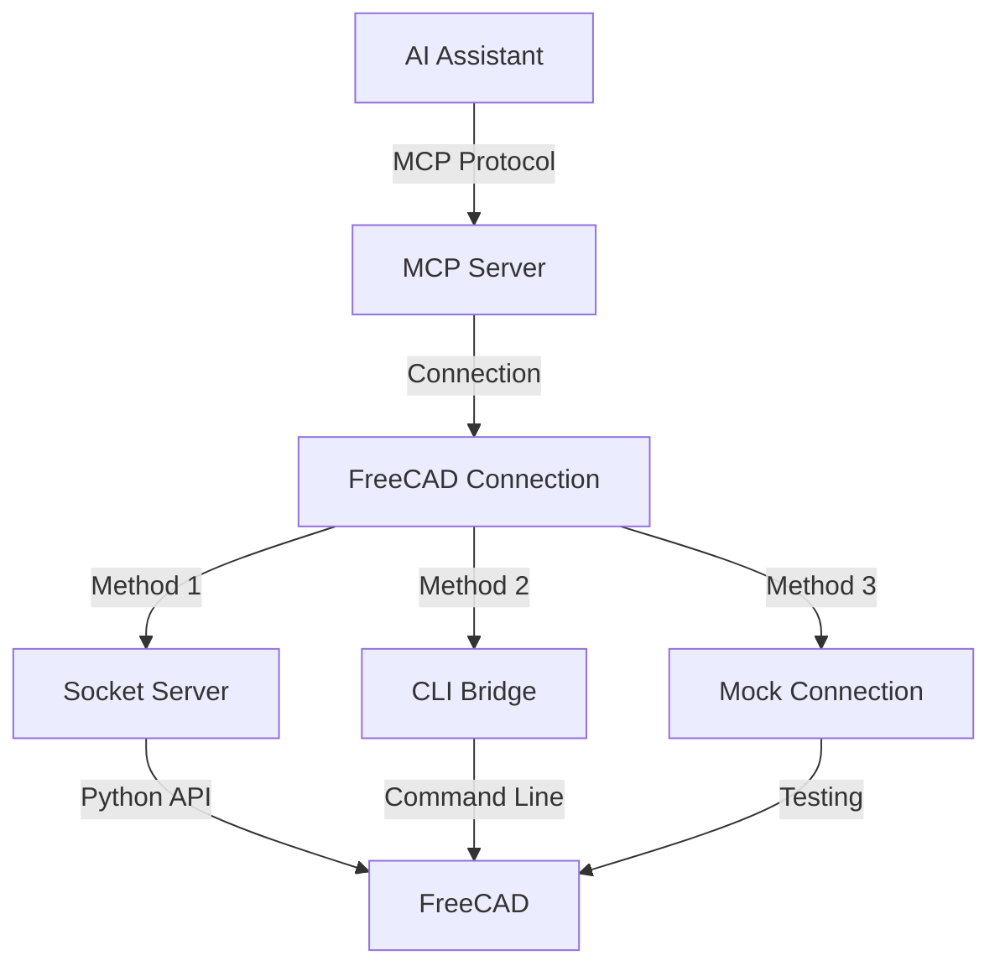

# 🛠️ MCP-FreeCAD Integration

This project provides a robust integration between AI assistants and FreeCAD CAD software using the **Model Context Protocol (MCP)**. It allows external applications to interact with FreeCAD through a standardized interface, offering multiple connection methods and specialized tools.

## 🔄 MCP Flow Chart



## 🏗️ Core Components

### 1. FreeCAD MCP Server (`freecad_mcp_server.py`)
- **Description**: The main server implementing the Model Context Protocol. It acts as the central hub for AI assistants to communicate with FreeCAD.
- **Features**:
    - Supports standard MCP requests (ListTools, ExecuteTool, ListResources, GetResource).
    - Connects to FreeCAD using various methods (see below).
    - Exposes specialized tools, including smithery operations.
    - Configurable via `config.json`.

### 2. FreeCAD Connection (`freecad_connection.py`)
- **Description**: A unified Python interface for connecting to FreeCAD, used internally by the MCP server and available for direct use.
- **Methods**:
    - **Socket Server Connection**: Communicates with a running `freecad_server.py` instance.
    - **CLI Bridge Connection**: Uses command-line calls via `freecad_bridge.py`.
    - **Mock Connection**: Provides a fallback for testing without a running FreeCAD instance.
    - **Auto Connection**: Automatically selects the best available method.

### 3. FreeCAD Server (`freecad_server.py`)
- **Description**: A standalone socket-based server script designed to run *inside* FreeCAD. It listens for commands from the `FreeCADConnection` (when using the `server` method).
- **Usage**:
    ```bash
    # Run inside FreeCAD's Python console
    exec(open("/path/to/freecad_server.py").read())

    # Or run from command line (starts FreeCAD in console mode)
    freecad -c /path/to/freecad_server.py --host localhost --port 12345 --debug
    ```

### 4. FreeCAD Bridge (`freecad_bridge.py`)
- **Description**: A Python module enabling command-line interaction with FreeCAD, bypassing direct module import issues. Used by `FreeCADConnection` when using the `bridge` method.

### 5. FreeCAD Client (`freecad_client.py`)
- **Description**: A command-line client utility for interacting directly with the `FreeCADConnection` interface (not the MCP server). Useful for basic testing and scripting outside the MCP context.
- **Example**: `python freecad_client.py create-box --length 20`

## ⚙️ Installation

1.  **Install FreeCAD**: Ensure FreeCAD is installed on your system and accessible from the command line.
2.  **Install Dependencies**:
    ```bash
    pip install modelcontextprotocol # For the MCP Server
    # Other dependencies might be listed in requirements.txt if available
    ```

## 🚀 Using the MCP Server

This is the primary way to interact with FreeCAD using AI assistants like Claude.

### Starting the MCP Server

```bash
# Start the server using the default config.json
./freecad_mcp_server.py

# Start with a specific configuration file
./freecad_mcp_server.py --config /path/to/your/config.json
```
The server will run and listen for connections from MCP clients.

### Connecting an MCP Client

Use any MCP-compatible client. Example using the reference `mcp client`:

```bash
# Replace 'mcp client' with the actual client command if different
mcp client connect stdio --command "./freecad_mcp_server.py"
```

Or using `uv` if you have a client script like the one in the MCP docs:

```bash
uv run path/to/your/mcp_client.py ./freecad_mcp_server.py
```

### MCP Server Configuration (`config.json`)

```json
{
    "server": {
        "name": "freecad-mcp-server",
        "version": "0.1.0"
    },
    "freecad": {
        "connection_method": "auto", // "auto", "server", "bridge", or "mock"
        "host": "localhost",          // For 'server' connection method
        "port": 12345,                // For 'server' connection method
        "freecad_path": "freecad"     // Path to FreeCAD executable (for 'bridge' method)
    },
    "tools": { // Optional: control which tool groups are enabled
        "enable_smithery": true,
        "enable_primitives": true,
        "enable_model_manipulation": true,
        "enable_export_import": true,
        "enable_measurement": true,
        "enable_code_generator": true
    }
}
```

## 🛠️ Available MCP Tools

The MCP server exposes various tool groups. Here are all available tools:

### 🔨 Smithery Tools (`smithery.*`)
- Specialized tools for blacksmithing and metalwork design:
    - `smithery.create_anvil`: Generate an anvil model with customizable dimensions
    - `smithery.create_hammer`: Generate a blacksmith hammer with adjustable handle and head dimensions
    - `smithery.create_tongs`: Generate blacksmith tongs with configurable handle and jaw parameters
    - `smithery.forge_blade`: Create knife/sword blade models with customizable dimensions
    - `smithery.create_horseshoe`: Create a horseshoe model with adjustable dimensions

### 📐 Basic FreeCAD Tools (`freecad.*`)
- `freecad.create_document`: Create a new document
- `freecad.export_stl`: Export the model or specific objects to STL
- `freecad.import_stl`: Import STL files into the current document
- `freecad.save_document`: Save the current document
- `freecad.load_document`: Load an existing document

### 🔧 Model Manipulation Tools (`model_manipulation.*`)
- `model_manipulation.rotate`: Rotate objects around specified axes
- `model_manipulation.translate`: Move objects in 3D space
- `model_manipulation.scale`: Scale objects uniformly or non-uniformly
- `model_manipulation.mirror`: Mirror objects across specified planes
- `model_manipulation.union`: Combine multiple objects using boolean union
- `model_manipulation.cut`: Cut objects using boolean difference
- `model_manipulation.intersect`: Create intersection of multiple objects

### 📏 Measurement Tools (`measurement.*`)
- `measurement.distance`: Measure distance between two points
- `measurement.angle`: Measure angle between three points
- `measurement.area`: Calculate surface area of objects
- `measurement.volume`: Calculate volume of solid objects
- `measurement.mass`: Calculate mass of objects (requires material properties)

### 📦 Primitives Tools (`primitives.*`)
- `primitives.create_box`: Create a rectangular box
- `primitives.create_cylinder`: Create a cylinder
- `primitives.create_sphere`: Create a sphere
- `primitives.create_cone`: Create a cone
- `primitives.create_torus`: Create a torus
- `primitives.create_polygon`: Create a regular polygon
- `primitives.create_ellipse`: Create an ellipse

### 🔄 Export/Import Tools (`export_import.*`)
- `export_import.export_step`: Export to STEP format
- `export_import.import_step`: Import from STEP format
- `export_import.export_iges`: Export to IGES format
- `export_import.import_iges`: Import from IGES format
- `export_import.export_dxf`: Export to DXF format
- `export_import.import_dxf`: Import from DXF format

### 💻 Code Generation Tools (`code_generator.*`)
- `code_generator.generate_python`: Generate Python code for the current model
- `code_generator.generate_openscad`: Generate OpenSCAD code for the current model
- `code_generator.generate_gcode`: Generate G-code for CNC machining
- `code_generator.generate_3d_print`: Generate optimized 3D printing settings

## 📝 Example MCP Interactions

Here are conceptual examples of using the MCP server with an AI assistant:

### Creating an Anvil

```
User: Can you create a blacksmith anvil model in FreeCAD?

Assistant: Okay, I can do that. I'll use the `smithery.create_anvil` tool.
[Tool Call: smithery.create_anvil]
[Tool Result: {"anvil_id": "Anvil", "message": "Created anvil...", "success": true}]

Assistant: I've created the anvil model in FreeCAD. It has the default dimensions. Would you like to customize it or export it?
```

### Creating a Hammer

```
User: Make me a blacksmith hammer with a 400mm handle.

Assistant: Sure, I can create a hammer with a longer handle.
[Tool Call: smithery.create_hammer (arguments: {"handle_length": 400.0})]
[Tool Result: {"hammer_id": "Hammer", "message": "Created hammer...", "success": true}]

Assistant: I've created the hammer with a 400mm handle and default head dimensions.
```

## 🔍 Troubleshooting

- **MCP Server Connection Issues**: Ensure the `freecad_mcp_server.py` script is running and executable. Check firewall settings if connecting remotely (though stdio is typical for local use).
- **FreeCAD Connection Issues**:
    - **`auto` or `bridge` method**: Verify FreeCAD is installed and the `freecad` command works in your terminal. Check the `freecad_path` in `config.json`.
    - **`server` method**: Ensure `freecad_server.py` is running inside an active FreeCAD instance, listening on the correct host/port configured in `config.json`.
    - **General**: Check FreeCAD logs for errors.
- **Missing MCP SDK**: Install via `pip install modelcontextprotocol`.
- **Python Path Issues**: If FreeCAD modules aren't found, ensure FreeCAD's `lib` directory is in your `PYTHONPATH` environment variable, especially when running scripts directly.

## 📄 License

This project is licensed under the MIT License - see the LICENSE file for details.

## 🖥️ Cursor Integration

The MCP server is fully compatible with Cursor IDE integration. To use it with Cursor:

1. Use the provided `cursor_config.json`:
```bash
./freecad_mcp_server.py --config cursor_config.json
```

2. The server uses stdio transport by default, which is compatible with Cursor's communication protocol.

3. Error handling has been enhanced to use proper MCP error responses, ensuring better integration with Cursor's error display.

4. Debug logging is enabled by default in the Cursor configuration to help with troubleshooting.

### Cursor-Specific Features

- Proper stdio transport handling for seamless integration
- Enhanced error responses using MCP's ErrorResponse format
- Debug mode for better visibility into server operations
- Automatic capability detection
- Improved logging for Cursor's console

### Cursor Configuration

The `cursor_config.json` file includes specific settings for Cursor integration:

```json
{
    "cursor": {
        "debug": true,
        "log_level": "INFO",
        "stdio_transport": true
    }
}
```

These settings ensure optimal performance when using the server with Cursor.

## 📋 Available Options and Use Cases

### 🔧 Connection Methods
1. **Socket Server Connection**
   - Use when running FreeCAD as a persistent server
   - Best for high-performance, continuous operations
   - Configuration:
   ```json
   {
       "freecad": {
           "connection_method": "server",
           "host": "localhost",
           "port": 12345
       }
   }
   ```

2. **CLI Bridge Connection**
   - Use when you need to start/stop FreeCAD for each operation
   - Good for occasional use or scripting
   - Configuration:
   ```json
   {
       "freecad": {
           "connection_method": "bridge",
           "freecad_path": "freecad"
       }
   }
   ```

3. **Mock Connection**
   - Use for testing without FreeCAD
   - Development and debugging
   - Configuration:
   ```json
   {
       "freecad": {
           "connection_method": "mock"
       }
   }
   ```

4. **Auto Connection**
   - Automatically selects the best available method
   - Default option
   - Configuration:
   ```json
   {
       "freecad": {
           "connection_method": "auto"
       }
   }
   ```

### 🛠️ Tool Categories and Use Cases

1. **Smithery Tools**
   - Creating blacksmithing equipment models
   - Use cases:
     * Design of anvils with custom dimensions
     * Modeling hammers with specific handle lengths
     * Creating tongs with adjustable jaw openings
     * Forging blade designs
     * Generating horseshoe models

2. **Basic FreeCAD Operations**
   - Essential document management
   - Use cases:
     * Creating new documents
     * Saving and loading projects
     * Exporting to various formats
     * Managing document structure

3. **Model Manipulation**
   - Transforming and modifying objects
   - Use cases:
     * Rotating objects precisely
     * Moving objects in 3D space
     * Scaling models
     * Creating mirrors and copies
     * Boolean operations (union, cut, intersect)

4. **Measurement Tools**
   - Analysis and verification
   - Use cases:
     * Distance measurements
     * Angle calculations
     * Surface area analysis
     * Volume calculations
     * Mass properties

5. **Primitive Creation**
   - Basic shape generation
   - Use cases:
     * Creating boxes and cylinders
     * Generating spheres
     * Making cones and tori
     * Creating regular polygons
     * Drawing ellipses

6. **Export/Import Operations**
   - File format conversion
   - Use cases:
     * STEP file export/import
     * IGES format handling
     * DXF file processing
     * STL export for 3D printing

7. **Code Generation**
   - Automated code creation
   - Use cases:
     * Python script generation
     * OpenSCAD code export
     * G-code generation for CNC
     * 3D printer settings optimization

### 💻 Integration Scenarios

1. **Cursor IDE Integration**
   - Development environment integration
   - Use cases:
     * Direct model manipulation from IDE
     * Real-time feedback
     * Debug logging
     * Error tracking

2. **AI Assistant Integration**
   - AI-powered design automation
   - Use cases:
     * Natural language model creation
     * Automated design modifications
     * Parameter optimization
     * Design validation

3. **Command Line Usage**
   - Scripting and automation
   - Use cases:
     * Batch processing
     * Automated testing
     * CI/CD integration
     * Command-line tools

### 🎯 Common Use Case Examples

1. **Rapid Prototyping**
```python
# Create a new document
freecad.create_document("Prototype")
# Add basic shapes
primitives.create_box(length=100, width=50, height=20)
# Export for 3D printing
export_import.export_stl("prototype.stl")
```

2. **Tool Design**
```python
# Create custom blacksmith tools
smithery.create_hammer(handle_length=400, head_width=45)
smithery.create_tongs(jaw_length=85, opening_angle=20)
```

3. **Model Analysis**
```python
# Measure object properties
volume = measurement.volume("Part1")
mass = measurement.mass("Part1", material="Steel")
```

4. **Automated Processing**
```python
# Import and modify multiple files
for file in files:
    import_step(file)
    model_manipulation.scale(1.5)
    export_stl(f"{file}_scaled.stl")
```

### ⚙️ Configuration Options

1. **Server Configuration**
```json
{
    "server": {
        "name": "custom-server-name",
        "version": "1.0.0",
        "description": "Custom description"
    }
}
```

2. **Tool Enablement**
```json
{
    "tools": {
        "enable_smithery": true,
        "enable_primitives": true,
        "enable_model_manipulation": true,
        "enable_export_import": true,
        "enable_measurement": true,
        "enable_code_generator": true
    }
}
```

3. **Debug Configuration**
```json
{
    "cursor": {
        "debug": true,
        "log_level": "DEBUG",
        "stdio_transport": true
    }
}
```
