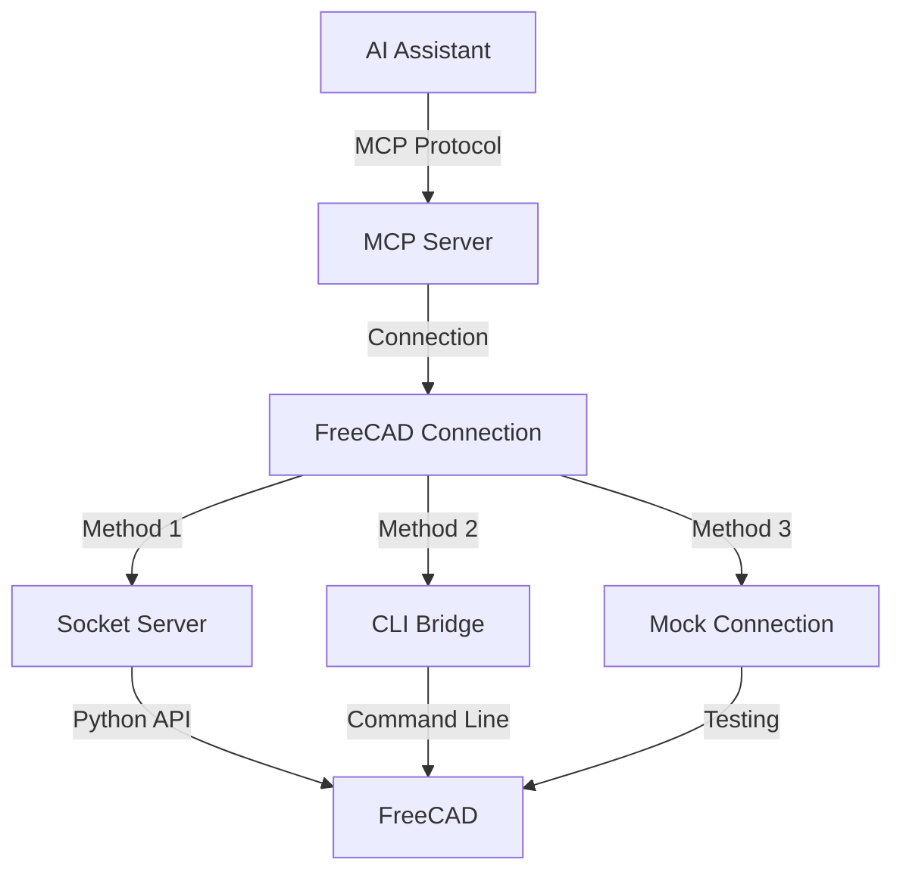

# 🛠️ MCP-FreeCAD Integration

This project provides a robust integration between AI assistants and FreeCAD CAD software using the **Model Context Protocol (MCP)**. It allows external applications to interact with FreeCAD through a standardized interface, offering multiple connection methods and specialized tools.

## 🔄 MCP Flow Chart



For more detailed flowcharts, see [FLOWCHART.md](docs/FLOWCHART.md).

## 🏗️ Core Components

### 1. FreeCAD MCP Server (`freecad_mcp_server.py`)
- **Description**: The main server implementing the Model Context Protocol. It acts as the central hub for AI assistants to communicate with FreeCAD.
- **Features**:
    - Supports standard MCP requests (ListTools, ExecuteTool, ListResources, GetResource).
    - Connects to FreeCAD using various methods (see below).
    - Exposes specialized tools, including smithery operations.
    - Configurable via `config.json`.

### 2. FreeCAD Connection (`freecad_connection.py`)
- **Description**: A unified Python interface for connecting to FreeCAD, used internally by the MCP server and available for direct use.
- **Methods**:
    - **Socket Server Connection**: Communicates with a running `freecad_server.py` instance.
    - **CLI Bridge Connection**: Uses command-line calls via `freecad_bridge.py`.
    - **Mock Connection**: Provides a fallback for testing without a running FreeCAD instance.
    - **Auto Connection**: Automatically selects the best available method.

### 3. FreeCAD Server (`freecad_server.py`)
- **Description**: A standalone socket-based server script designed to run *inside* FreeCAD. It listens for commands from the `FreeCADConnection` (when using the `server` method).
- **Usage**:
    ```bash
    # Run inside FreeCAD's Python console
    exec(open("/path/to/freecad_server.py").read())

    # Or run from command line (starts FreeCAD in console mode)
    freecad -c /path/to/freecad_server.py --host localhost --port 12345 --debug
    ```

See [FREECAD_SERVER_SETUP.md](docs/FREECAD_SERVER_SETUP.md) for detailed setup instructions.

### 4. FreeCAD Bridge (`freecad_bridge.py`)
- **Description**: A Python module enabling command-line interaction with FreeCAD, bypassing direct module import issues. Used by `FreeCADConnection` when using the `bridge` method.

### 5. FreeCAD Client (`freecad_client.py`)
- **Description**: A command-line client utility for interacting directly with the `FreeCADConnection` interface (not the MCP server). Useful for basic testing and scripting outside the MCP context.
- **Example**: `python freecad_client.py create-box --length 20`

## 📁 Project Structure

The MCP-FreeCAD project is organized with the following directory structure:

```
mcp-freecad/
├── assets/                  # 3D model assets (STL, STEP files)
├── backups/                 # Backup files
├── config.json              # Main configuration file
├── docs/                    # Documentation files
│   ├── FLOWCHART.md         # Detailed flow diagrams
│   ├── FREECAD_INTEGRATION.md # FreeCAD integration guide
│   ├── FREECAD_SERVER_SETUP.md # Server setup instructions
│   ├── OPTIMIZATION_FEATURES.md # Performance optimization guide
│   └── PYTHON_INTERPRETER_SETUP.md # Python interpreter configuration
├── examples/                # Example scripts showing API usage
├── freecad_bridge.py        # Bridge for CLI interaction with FreeCAD
├── freecad_client.py        # Command-line client
├── freecad_connection.py    # Unified connection interface
├── freecad_mcp.py           # Entry point script
├── freecad_mcp_server.py    # MCP server implementation
├── freecad_server.py        # Socket-based server for FreeCAD
├── scripts/                 # Shell scripts for installation and execution
│   ├── README.md            # Scripts documentation
│   ├── bin/                 # Executable scripts
│   │   ├── install-global.sh    # Global installation script
│   │   ├── mcp-freecad-installer.sh # Installer script
│   │   ├── mcp-freecad.sh       # Simple wrapper script
│   │   └── run_freecad_server.sh # Server runner script
│   ├── start_freecad_with_server.sh # FreeCAD starter with server
│   └── start_server.py       # Python script for server startup
├── src/                     # Source code
├── tests/                   # Test files
└── tmp/                     # Temporary files
```

For more details on scripts, see [scripts/README.md](scripts/README.md).

## ⚙️ Installation

There are several ways to install and use the MCP-FreeCAD server:

### 1. Quick Start for AI Tools

To install and run the MCP-FreeCAD server in a single command, run:

```bash
curl -sSL https://raw.githubusercontent.com/jango-blockchained/mcp-freecad/main/scripts/bin/mcp-freecad-installer.sh | bash
```

This command will:
1. Clone the MCP-FreeCAD repository (or update it if already cloned)
2. Set up a Python virtual environment
3. Install all dependencies
4. Start the MCP server

After installation, you can run the server directly with:

```bash
~/.mcp-freecad/scripts/bin/mcp-freecad.sh
```

### 2. Global Installation

If you have cloned the repository, you can install the MCP-FreeCAD server globally on your system:

```bash
# Navigate to the repository
cd /path/to/mcp-freecad

# Run the global installation script
./scripts/bin/install-global.sh
```

After installation, you can run the server from anywhere with:

```bash
mcp-freecad
```

### 3. Manual Installation

You can also install the server manually:

```bash
# Clone the repository
git clone https://github.com/jango-blockchained/mcp-freecad.git
cd mcp-freecad

# Create a virtual environment
python -m venv .venv
source .venv/bin/activate  # On Windows: .venv\Scripts\activate

# Install dependencies
pip install -r requirements.txt

# Install the package in development mode
pip install -e .

# Run the server
python freecad_mcp_server.py
```

### 4. Recommended Setup: Using FreeCAD AppImage (Most Reliable)

For the most reliable FreeCAD connection, especially if you encounter module import issues, we recommend using the FreeCAD AppImage:

1.  **Download a FreeCAD AppImage**: Get the latest stable or weekly build AppImage from the [FreeCAD releases page](https://github.com/FreeCAD/FreeCAD/releases).

2.  **Make it Executable**: `chmod +x /path/to/FreeCAD_*.AppImage`

3.  **Extract the AppImage**: Use the provided utility script to extract the AppImage. This creates a self-contained FreeCAD environment.

    ```bash
    # Navigate to the mcp-freecad directory
    cd /path/to/mcp-freecad
    
    # Run the extraction script
    ./extract_appimage.py /path/to/FreeCAD_*.AppImage
    
    # Optional: Specify output directory
    # ./extract_appimage.py /path/to/FreeCAD_*.AppImage --output /custom/extract/path
    ```
    This script will:
    - Extract the AppImage to a `squashfs-root` directory (by default, next to the AppImage).
    - **Automatically update your `config.json`** to use the extracted AppImage (`use_apprun: true`, `apprun_path` set correctly, `connection_method: launcher`).
    - Test the extracted AppImage to ensure it works.

4.  **Start the MCP Server**: The server will now use the `launcher` connection method with the extracted AppImage environment.

    ```bash
    python freecad_mcp_server.py
    ```

This method avoids potential conflicts with system Python versions and ensures all necessary FreeCAD dependencies and modules are correctly loaded.

### 5. FreeCAD Python Interpreter Setup

For proper integration with FreeCAD's Python modules, see [PYTHON_INTERPRETER_SETUP.md](docs/PYTHON_INTERPRETER_SETUP.md) which explains how to:

- Extract and use FreeCAD's AppImage Python interpreter
- Set up a virtual environment with FreeCAD's Python
- Configure `PYTHONPATH` for FreeCAD module access

## 🚀 Using the MCP Server

This is the primary way to interact with FreeCAD using AI assistants like Claude.

### Starting the MCP Server

```bash
# Start the server using the default config.json
python freecad_mcp_server.py

# Start with a specific configuration file
python freecad_mcp_server.py --config /path/to/your/config.json

# Enable debug logging
python freecad_mcp_server.py --debug
```
The server will run and listen for connections from MCP clients.

### Connecting an MCP Client

Use any MCP-compatible client. Example using the reference `mcp client`:

```bash
# Replace 'mcp client' with the actual client command if different
mcp client connect stdio --command "python freecad_mcp_server.py"
```

Or using `uv` if you have a client script like the one in the MCP docs:

```bash
uv run path/to/your/mcp_client.py python freecad_mcp_server.py
```

### Alternative: Starting FreeCAD with Integrated Server

You can also start FreeCAD with the integrated server using:

```bash
./scripts/start_freecad_with_server.sh
```

This will launch FreeCAD and automatically start the server inside it.

### MCP Server Configuration (`config.json`)

```json
{
    "server": {
        "name": "mcp-freecad",
        "version": "0.1.0"
    },
    "freecad": {
        "path": "/usr/bin/freecad",
        "python_path": "./squashfs-root/usr/bin/python",
        "host": "localhost",
        "port": 12345,
        "auto_connect": true,
        "reconnect_on_failure": true,
        "use_mock": false,
        "connection_method": "server"
    },
    "tools": { // Optional: control which tool groups are enabled
        "enable_smithery": true,
        "enable_primitives": true,
        "enable_model_manipulation": true,
        "enable_export_import": true,
        "enable_measurement": true,
        "enable_code_generator": true
    }
}
```

See [FREECAD_INTEGRATION.md](docs/FREECAD_INTEGRATION.md) for more details on integration options.

## 🛠️ Available MCP Tools

The MCP server exposes various tool groups. Here are all available tools:

### 🔨 Smithery Tools (`smithery.*`)
- Specialized tools for blacksmithing and metalwork design:
    - `smithery.create_anvil`: Generate an anvil model with customizable dimensions
    - `smithery.create_hammer`: Generate a blacksmith hammer with adjustable handle and head dimensions
    - `smithery.create_tongs`: Generate blacksmith tongs with configurable handle and jaw parameters
    - `smithery.forge_blade`: Create knife/sword blade models with customizable dimensions
    - `smithery.create_horseshoe`: Create a horseshoe model with adjustable dimensions

### 📐 Basic FreeCAD Tools (`freecad.*`)
- `freecad.create_document`: Create a new document
- `freecad.export_stl`: Export the model or specific objects to STL
- `freecad.import_stl`: Import STL files into the current document
- `freecad.save_document`: Save the current document
- `freecad.load_document`: Load an existing document

### 🔧 Model Manipulation Tools (`model_manipulation.*`)
- `model_manipulation.rotate`: Rotate objects around specified axes
- `model_manipulation.translate`: Move objects in 3D space
- `model_manipulation.scale`: Scale objects uniformly or non-uniformly
- `model_manipulation.mirror`: Mirror objects across specified planes
- `model_manipulation.union`: Combine multiple objects using boolean union
- `model_manipulation.cut`: Cut objects using boolean difference
- `model_manipulation.intersect`: Create intersection of multiple objects

### 📏 Measurement Tools (`measurement.*`)
- `measurement.distance`: Measure distance between two points
- `measurement.angle`: Measure angle between three points
- `measurement.area`: Calculate surface area of objects
- `measurement.volume`: Calculate volume of solid objects
- `measurement.mass`: Calculate mass of objects (requires material properties)

### 📦 Primitives Tools (`primitives.*`)
- `primitives.create_box`: Create a rectangular box
- `primitives.create_cylinder`: Create a cylinder
- `primitives.create_sphere`: Create a sphere
- `primitives.create_cone`: Create a cone
- `primitives.create_torus`: Create a torus
- `primitives.create_polygon`: Create a regular polygon
- `primitives.create_ellipse`: Create an ellipse

### 🔄 Export/Import Tools (`export_import.*`)
- `export_import.export_step`: Export to STEP format
- `export_import.import_step`: Import from STEP format
- `export_import.export_iges`: Export to IGES format
- `export_import.import_iges`: Import from IGES format
- `export_import.export_dxf`: Export to DXF format
- `export_import.import_dxf`: Import from DXF format

### 💻 Code Generation Tools (`code_generator.*`)
- `code_generator.generate_python`: Generate Python code for the current model
- `code_generator.generate_openscad`: Generate OpenSCAD code for the current model
- `code_generator.generate_gcode`: Generate G-code for CNC machining
- `code_generator.generate_3d_print`: Generate optimized 3D printing settings

## 📝 Example MCP Interactions

Here are conceptual examples of using the MCP server with an AI assistant:

### Creating an Anvil

```
User: Can you create a blacksmith anvil model in FreeCAD?

Assistant: Okay, I can do that. I'll use the `smithery.create_anvil` tool.
[Tool Call: smithery.create_anvil]
[Tool Result: {"anvil_id": "Anvil", "message": "Created anvil...", "success": true}]

Assistant: I've created the anvil model in FreeCAD. It has the default dimensions. Would you like to customize it or export it?
```

### Creating a Hammer

```
User: Make me a blacksmith hammer with a 400mm handle.

Assistant: Sure, I can create a hammer with a longer handle.
[Tool Call: smithery.create_hammer (arguments: {"handle_length": 400.0})]
[Tool Result: {"hammer_id": "Hammer", "message": "Created hammer...", "success": true}]

Assistant: I've created the hammer with a 400mm handle and default head dimensions.
```

## 🔍 Troubleshooting

- **MCP Server Connection Issues**: Ensure the `freecad_mcp_server.py` script is running and executable. Check firewall settings if connecting remotely (though stdio is typical for local use).
- **FreeCAD Connection Issues**:
    - **`auto` or `bridge` method**: Verify FreeCAD is installed and the `freecad` command works in your terminal. Check the `freecad_path` in `config.json`.
    - **`server` method**: Ensure `freecad_server.py` is running inside an active FreeCAD instance, listening on the correct host/port configured in `config.json`.
    - **General**: Check FreeCAD logs for errors.
- **Missing MCP SDK**: Install via `pip install modelcontextprotocol`.
- **Python Path Issues**: If FreeCAD modules aren't found, refer to [PYTHON_INTERPRETER_SETUP.md](docs/PYTHON_INTERPRETER_SETUP.md) for detailed guidance.

## 📄 License

This project is licensed under the MIT License - see the LICENSE file for details.

## 🖥️ Cursor Integration

The MCP server is fully compatible with Cursor IDE integration. To use it with Cursor:

1. Use the provided `cursor_config.json`:
```bash
./freecad_mcp_server.py --config cursor_config.json
```

2. The server uses stdio transport by default, which is compatible with Cursor's communication protocol.

3. Error handling has been enhanced to use proper MCP error responses, ensuring better integration with Cursor's error display.

4. Debug logging is enabled by default in the Cursor configuration to help with troubleshooting.

### Cursor-Specific Features

- Proper stdio transport handling for seamless integration
- Enhanced error responses using MCP's ErrorResponse format
- Debug mode for better visibility into server operations
- Automatic capability detection
- Improved logging for Cursor's console

### Cursor Configuration

The `cursor_config.json` file includes specific settings for Cursor integration:

```json
{
    "cursor": {
        "debug": true,
        "log_level": "INFO",
        "stdio_transport": true
    }
}
```

These settings ensure optimal performance when using the server with Cursor.

## 📋 Available Options and Use Cases

### 🔧 Connection Methods
1. **Socket Server Connection**
   - Use when running FreeCAD as a persistent server
   - Best for high-performance, continuous operations
   - Configuration:
   ```json
   {
       "freecad": {
           "connection_method": "server",
           "host": "localhost",
           "port": 12345
       }
   }
   ```

2. **CLI Bridge Connection**
   - Use when you need to start/stop FreeCAD for each operation
   - Good for occasional use or scripting
   - Configuration:
   ```json
   {
       "freecad": {
           "connection_method": "bridge",
           "freecad_path": "freecad"
       }
   }
   ```

3. **Mock Connection**
   - Use for testing without FreeCAD
   - Development and debugging
   - Configuration:
   ```json
   {
       "freecad": {
           "connection_method": "mock"
       }
   }
   ```

4. **Auto Connection**
   - Automatically selects the best available method
   - Default option
   - Configuration:
   ```json
   {
       "freecad": {
           "connection_method": "auto"
       }
   }
   ```

### 🛠️ Tool Categories and Use Cases

1. **Smithery Tools**
   - Creating blacksmithing equipment models
   - Use cases:
     * Design of anvils with custom dimensions
     * Modeling hammers with specific handle lengths
     * Creating tongs with adjustable jaw openings
     * Forging blade designs
     * Generating horseshoe models

2. **Basic FreeCAD Operations**
   - Essential document management
   - Use cases:
     * Creating new documents
     * Saving and loading projects
     * Exporting to various formats
     * Managing document structure

3. **Model Manipulation**
   - Transforming and modifying objects
   - Use cases:
     * Rotating objects precisely
     * Moving objects in 3D space
     * Scaling models
     * Creating mirrors and copies
     * Boolean operations (union, cut, intersect)

4. **Measurement Tools**
   - Analysis and verification
   - Use cases:
     * Distance measurements
     * Angle calculations
     * Surface area analysis
     * Volume calculations
     * Mass properties

5. **Primitive Creation**
   - Basic shape generation
   - Use cases:
     * Creating boxes and cylinders
     * Generating spheres
     * Making cones and tori
     * Creating regular polygons
     * Drawing ellipses

6. **Export/Import Operations**
   - File format conversion
   - Use cases:
     * STEP file export/import
     * IGES format handling
     * DXF file processing
     * STL export for 3D printing

7. **Code Generation**
   - Automated code creation
   - Use cases:
     * Python script generation
     * OpenSCAD code export
     * G-code generation for CNC
     * 3D printer settings optimization

### 💻 Integration Scenarios

1. **Cursor IDE Integration**
   - Development environment integration
   - Use cases:
     * Direct model manipulation from IDE
     * Real-time feedback
     * Debug logging
     * Error tracking

2. **AI Assistant Integration**
   - AI-powered design automation
   - Use cases:
     * Natural language model creation
     * Automated design modifications
     * Parameter optimization
     * Design validation

3. **Command Line Usage**
   - Scripting and automation
   - Use cases:
     * Batch processing
     * Automated testing
     * CI/CD integration
     * Command-line tools

### 🎯 Common Use Case Examples

1. **Rapid Prototyping**
```python
# Create a new document
freecad.create_document("Prototype")
# Add basic shapes
primitives.create_box(length=100, width=50, height=20)
# Export for 3D printing
export_import.export_stl("prototype.stl")
```

2. **Tool Design**
```python
# Create custom blacksmith tools
smithery.create_hammer(handle_length=400, head_width=45)
smithery.create_tongs(jaw_length=85, opening_angle=20)
```

3. **Model Analysis**
```python
# Measure object properties
volume = measurement.volume("Part1")
mass = measurement.mass("Part1", material="Steel")
```

4. **Automated Processing**
```python
# Import and modify multiple files
for file in files:
    import_step(file)
    model_manipulation.scale(1.5)
    export_stl(f"{file}_scaled.stl")
```

### ⚙️ Configuration Options

1. **Server Configuration**
```json
{
    "server": {
        "name": "custom-server-name",
        "version": "1.0.0",
        "description": "Custom description"
    }
}
```

2. **Tool Enablement**
```json
{
    "tools": {
        "enable_smithery": true,
        "enable_primitives": true,
        "enable_model_manipulation": true,
        "enable_export_import": true,
        "enable_measurement": true,
        "enable_code_generator": true
    }
}
```

3. **Debug Configuration**
```json
{
    "cursor": {
        "debug": true,
        "log_level": "DEBUG",
        "stdio_transport": true
    }
}
```

## Features

- Connect AI assistants to FreeCAD through the MCP protocol
- Create and manipulate 3D models programmatically
- Support for primitive shapes (box, cylinder, sphere, cone)
- Boolean operations (union, intersection, cut)
- Object transformations (move, rotate)
- Export models to STL format
- Document and object management
- Specialty smithery tools for blacksmithing models

## Prerequisites

- FreeCAD 0.20 or newer installed on the system
- Python 3.8 or newer
- MCP SDK (`pip install modelcontextprotocol`)

## Available Tools

### Document Management

1. **freecad.create_document** - Create a new FreeCAD document
2. **freecad.list_documents** - List all open documents
3. **freecad.list_objects** - List all objects in a document

### 3D Primitives

1. **freecad.create_box** - Create a box primitive
2. **freecad.create_cylinder** - Create a cylinder primitive
3. **freecad.create_sphere** - Create a sphere primitive
4. **freecad.create_cone** - Create a cone primitive

### Boolean Operations

1. **freecad.boolean_union** - Create a union of two objects (add)
2. **freecad.boolean_cut** - Cut the second object from the first (subtract)
3. **freecad.boolean_intersection** - Create the intersection of two objects (common volume)

### Transformations

1. **freecad.move_object** - Move an object to a new position
2. **freecad.rotate_object** - Rotate an object

### Export

1. **freecad.export_stl** - Export the model to an STL file

### Smithery Tools (Specialty Tools)

1. **smithery.create_anvil** - Create an anvil model
2. **smithery.create_hammer** - Create a blacksmith hammer model
3. **smithery.create_tongs** - Create blacksmith tongs model
4. **smithery.forge_blade** - Create a forged blade model
5. **smithery.create_horseshoe** - Create a horseshoe model

## Testing

The project includes both unit tests and end-to-end (E2E) tests to ensure quality and reliability.

### Unit Tests

To run the basic unit tests:

```bash
python test_mcp_tools.py
python test_mcp_client.py
```

### End-to-End Tests

End-to-end tests verify that the entire system works correctly from the client's perspective. They test real-world scenarios and interactions between different components.

To run all E2E tests:

```bash
# Run with mock FreeCAD (default, doesn't require actual FreeCAD installation)
./tests/e2e/run_tests.py

# Run with verbose output
./tests/e2e/run_tests.py --verbose

# Run with real FreeCAD connection (requires FreeCAD to be installed)
./tests/e2e/run_tests.py --real

# Run a specific test file
./tests/e2e/run_tests.py --single test_primitives.py
```

The E2E tests are organized by functionality:
- `test_primitives.py` - Tests for basic shape creation and manipulation
- `test_smithery.py` - Tests for blacksmithing tool operations

#### Writing New E2E Tests

To add new E2E tests:

1. Create a new test file in the `tests/e2e/` directory
2. Extend the appropriate base test class (`MCPClientTestBase`)
3. Add test methods that use the MCP client to interact with the tools
4. Run your tests with the test runner

See existing test files for examples.

## Documentation

The project includes several documentation files for different aspects:

- [PYTHON_INTERPRETER_SETUP.md](docs/PYTHON_INTERPRETER_SETUP.md) - How to configure the Python interpreter
- [FREECAD_SERVER_SETUP.md](docs/FREECAD_SERVER_SETUP.md) - Server setup guide
- [FREECAD_INTEGRATION.md](docs/FREECAD_INTEGRATION.md) - FreeCAD integration methods
- [FLOWCHART.md](docs/FLOWCHART.md) - Detailed flow diagrams
- [OPTIMIZATION_FEATURES.md](docs/OPTIMIZATION_FEATURES.md) - Performance optimization guide
- [scripts/README.md](scripts/README.md) - Scripts documentation

For AI assistants, please refer to the [AI_ASSISTANT_GUIDE.md](AI_ASSISTANT_GUIDE.md) for detailed usage instructions and examples.

## Contributing

Contributions are welcome! Please feel free to submit a Pull Request.

## Acknowledgments

- FreeCAD development team for the amazing CAD software
- Anthropic and Claude for the Model Context Protocol (MCP) SDK
