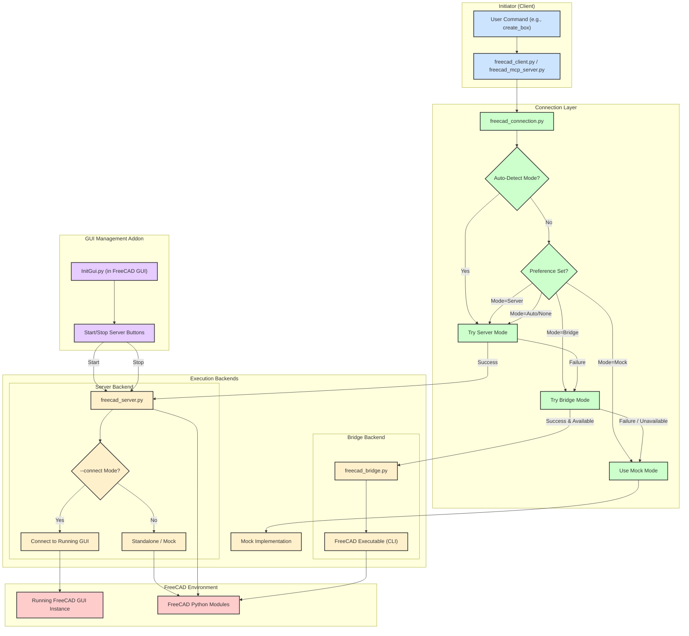

# FreeCAD MCP/Client/Server Interaction Flowchart

This document outlines the different ways the provided Python scripts interact to control FreeCAD.

## Components

1.  **User/Client Application (`freecad_client.py` / `freecad_mcp_server.py`)**: The application that wants to perform actions in FreeCAD.
2.  **Connection Layer (`freecad_connection.py`)**: A smart layer that determines the best way to talk to FreeCAD.
3.  **Execution Backends**:
    *   **Socket Server (`freecad_server.py`)**: Runs inside or connects to FreeCAD, listens on a socket.
    *   **CLI Bridge (`freecad_bridge.py`)**: Executes FreeCAD commands via subprocesses and temporary files.
    *   **Mock**: A fallback simulation if no real FreeCAD connection is available.
4.  **FreeCAD Instance**: The actual FreeCAD application.
5.  **GUI Indicator (`InitGui.py`)**: A FreeCAD Addon to manage `freecad_server.py`.

## Use Cases & Connection Modes

The `FreeCADConnection` class determines the connection method based on availability and preference (`prefer_method` argument):

1.  **`server` Mode (Preferred/Default)**:
    *   `freecad_connection.py` attempts to connect to `freecad_server.py` running on the specified host/port.
    *   Requires `freecad_server.py` to be running independently (either standalone or started with `--connect`).
    *   Offers the most features, especially if `freecad_server.py` is running with `--connect` (access to `FreeCADGui`).

2.  **`bridge` Mode (Fallback/Alternative)**:
    *   If the server connection fails or `bridge` is preferred, `freecad_connection.py` uses `FreeCADBridge`.
    *   `FreeCADBridge` uses the `freecad` command-line executable via `subprocess`.
    *   Does *not* require `freecad_server.py` to be running.
    *   Requires the `freecad` executable to be in the system PATH or specified correctly.
    *   Generally slower than the server mode and cannot easily interact with a running GUI session.

3.  **`mock` Mode (Fallback)**:
    *   If both `server` and `bridge` methods fail or are unavailable, `freecad_connection.py` falls back to a mock implementation.
    *   Simulates FreeCAD operations without actually running FreeCAD. Useful for testing client logic without a full FreeCAD setup.

4.  **`auto` Mode (Default Behavior)**:
    *   `freecad_connection.py` tries methods in order: `server`, then `bridge`, then `mock`. It uses the first one that succeeds.

5.  **`freecad_server.py` Execution Modes**:
    *   **Standalone**: `python freecad_server.py`. Runs using its own embedded FreeCAD modules (if found) or mock mode. Does *not* interact with a running FreeCAD GUI instance. `FreeCADGui` is likely unavailable.
    *   **Connect**: `python freecad_server.py --connect`. Tries to connect to an *already running* FreeCAD GUI instance. This allows interaction with the active GUI document and potentially uses `FreeCADGui`.

6.  **GUI Indicator (`InitGui.py`)**:
    *   Provides buttons within the FreeCAD GUI to start `freecad_server.py`.
    *   Can start the server in "Standalone" or "Connect to FreeCAD" mode.
    *   Helps manage the lifecycle of the `freecad_server.py` process for the `server` connection mode.

## Mermaid Flowchart

This flowchart illustrates the decision-making process within `freecad_connection.py` and how different backends (`freecad_server.py`, `freecad_bridge.py`) interact with the FreeCAD environment. The GUI Indicator provides a user-friendly way to manage the `freecad_server.py` component.

---

**Running the Examples:**

The `examples/` directory contains various scripts to test the different components and connection methods:

1.  **`test_freecad_import.py`**: Checks if the basic `FreeCAD` module can be imported directly. Useful for debugging path issues. Run with `python examples/test_freecad_import.py`.
2.  **`test_freecad_subprocess.py`**: Tests running a simple FreeCAD command via `subprocess`, similar to how the bridge *might* work internally. Run with `python examples/test_freecad_subprocess.py`.
3.  **`freecad_cli_test.py`**: Uses the `freecad_bridge.py` directly to perform some operations. Run with `python examples/freecad_cli_test.py`.
4.  **`use_freecad.py`**: A simple script demonstrating direct import and use of FreeCAD modules (requires FreeCAD Python environment or correctly set paths). Run with `python examples/use_freecad.py`.
5.  **`test_freecad_connection.py`**: Tests the `FreeCADConnection` class, attempting to connect using different methods. You might need to start `freecad_server.py` separately for the "server" mode tests to pass. Run with `python examples/test_freecad_connection.py`.
6.  **`demo.py`**: A comprehensive demo likely using `freecad_client.py` or `freecad_connection.py` to showcase various features. Run with `python examples/demo.py`. You may need `freecad_server.py` running for this, depending on how it connects.

**To run examples effectively:**

*   **For examples using the `server` connection:**
    *   Start FreeCAD.
    *   Use the MCP Indicator Addon (or run manually) `python freecad_server.py --connect`.
    *   Run the example script (e.g., `python examples/test_freecad_connection.py`).
*   **For examples using the `bridge` connection:**
    *   Ensure the `freecad` executable is in your PATH.
    *   Run the example script (e.g., `python examples/freecad_cli_test.py` or `python examples/test_freecad_connection.py` - it should auto-detect bridge if server isn't running).
*   **For direct import examples (`use_freecad.py`, `test_freecad_import.py`):**
    *   Run them using the Python interpreter associated with your FreeCAD installation or ensure `sys.path` is correctly configured.
