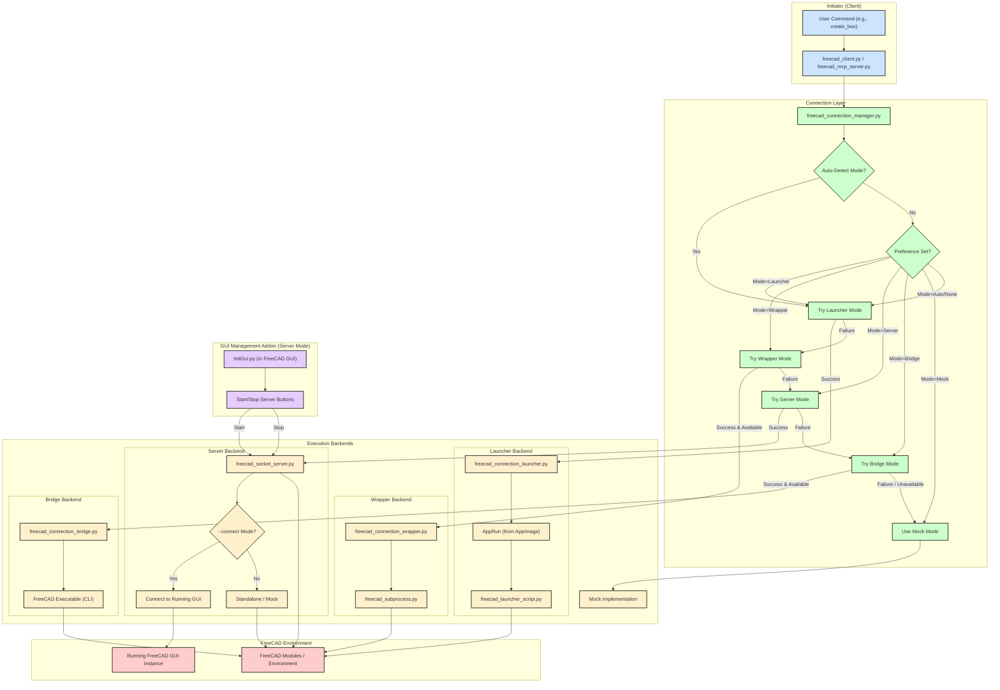

# FreeCAD MCP/Client/Server Interaction Flowchart

This document outlines the different ways the provided Python scripts interact to control FreeCAD using the `FreeCADConnection` interface.

## Components

1.  **User/Client Application (`freecad_client.py` / `src/mcp_freecad/server/freecad_mcp_server.py`)**: The application that wants to perform actions in FreeCAD.
2.  **Connection Layer (`freecad_connection_manager.py`)**: A smart layer that determines the best way to talk to FreeCAD.
3.  **Execution Backends**:
    *   **Launcher (`freecad_connection_launcher.py`)**: (Recommended) Launches FreeCAD (often via AppRun) and runs `freecad_launcher_script.py` inside it.
    *   **Wrapper (`freecad_connection_wrapper.py`)**: Runs `freecad_subprocess.py` which imports FreeCAD modules.
    *   **Socket Server (`freecad_socket_server.py`)**: Runs inside or connects to FreeCAD, listens on a socket.
    *   **CLI Bridge (`freecad_connection_bridge.py`)**: Executes FreeCAD commands via the command-line executable.
    *   **Mock**: A fallback simulation if no real FreeCAD connection is available.
4.  **FreeCAD Instance/Environment**: The actual FreeCAD application, its Python modules, or the AppRun environment.
5.  **GUI Indicator (`InitGui.py`)**: (Optional) A FreeCAD Addon to manage `freecad_socket_server.py` for the `server` method.

## Use Cases & Connection Modes

The `FreeCADConnection` class determines the connection method based on availability and preference (`prefer_method` argument):

1.  **`launcher` Mode (Recommended)**:
    *   Uses `freecad_connection_launcher.py` to start FreeCAD, often via `AppRun` from an extracted AppImage.
    *   Runs `freecad_launcher_script.py` within the launched FreeCAD environment.
    *   Considered the most reliable method, especially with AppImages.
    *   Setup is often automated by `extract_appimage.py`.

2.  **`wrapper` Mode**:
    *   Uses `freecad_connection_wrapper.py` which starts `freecad_subprocess.py`.
    *   `freecad_subprocess.py` attempts to `import FreeCAD` directly.
    *   Requires a Python environment where FreeCAD modules can be imported (e.g., system install or correctly configured AppImage Python).

3.  **`server` Mode**:
    *   `freecad_connection_manager.py` attempts to connect to `freecad_socket_server.py` running on the specified host/port.
    *   Requires `freecad_socket_server.py` to be running independently inside FreeCAD.
    *   Can interact with `FreeCADGui` if the server is started with `--connect`.

4.  **`bridge` Mode (Legacy)**:
    *   Uses `FreeCADBridge` which calls the `freecad` command-line executable.
    *   Does *not* require `freecad_socket_server.py`.
    *   Generally slower and less reliable.

5.  **`mock` Mode (Fallback)**:
    *   If all other methods fail or `use_mock` is true.
    *   Simulates FreeCAD operations.

6.  **`auto` Mode (Default Behavior)**:
    *   `freecad_connection_manager.py` tries methods in order: `launcher`, `wrapper`, `server`, `bridge`, then `mock`. It uses the first one that succeeds.

## Mermaid Flowchart

This flowchart illustrates the decision-making process within `freecad_connection_manager.py`, showing the priority order (Launcher > Wrapper > Server > Bridge > Mock) and how different backends interact with the FreeCAD environment.

---

**Running the Examples:**

The `examples/` directory contains various scripts to test the different components and connection methods:

1.  **`test_freecad_import.py`**: Checks if the basic `FreeCAD` module can be imported directly. Useful for debugging path issues. Run with `python examples/test_freecad_import.py`.
2.  **`test_freecad_subprocess.py`**: Tests running a simple FreeCAD command via `subprocess`, similar to how the bridge *might* work internally. Run with `python examples/test_freecad_subprocess.py`.
3.  **`freecad_cli_test.py`**: Uses the `freecad_connection_bridge.py` directly to perform some operations. Run with `python examples/freecad_cli_test.py`.
4.  **`use_freecad.py`**: A simple script demonstrating direct import and use of FreeCAD modules (requires FreeCAD Python environment or correctly set paths). Run with `python examples/use_freecad.py`.
5.  **`test_freecad_connection_manager.py`**: Tests the `FreeCADConnection` class, attempting to connect using different methods. You might need to start `freecad_socket_server.py` separately for the "server" mode tests to pass. Run with `python examples/test_freecad_connection_manager.py`.
6.  **`demo.py`**: A comprehensive demo likely using `freecad_client.py` or `freecad_connection_manager.py` to showcase various features. Run with `python examples/demo.py`. You may need `freecad_socket_server.py` running for this, depending on how it connects.

**To run examples effectively:**

*   **For examples using the `launcher` or `wrapper` connection (or `auto` mode with AppImage setup):**
    *   Ensure the environment is set up (AppImage extracted, `config.json` updated by `extract_appimage.py` or `setup_freecad_env.sh`).
    *   Run the example script (e.g., `python examples/test_freecad_connection_manager.py`). It should automatically use the configured method.
*   **For examples using the `server` connection:**
    *   Start FreeCAD.
    *   Use the MCP Indicator Addon (or run manually) `python freecad_socket_server.py --connect`.
    *   Ensure `config.json` is set to `connection_method: server`.
    *   Run the example script (e.g., `python examples/test_freecad_connection_manager.py`).
*   **For examples using the `bridge` connection:**
    *   Ensure the `freecad` executable is in your PATH.
    *   Ensure `config.json` is set to `connection_method: bridge`.
    *   Run the example script (e.g., `python examples/freecad_cli_test.py` or `python examples/test_freecad_connection_manager.py`).
*   **For direct import examples (`use_freecad.py`, `test_freecad_import.py`):**
    *   Run them using the Python interpreter associated with your FreeCAD installation or ensure `sys.path` is correctly configured.
