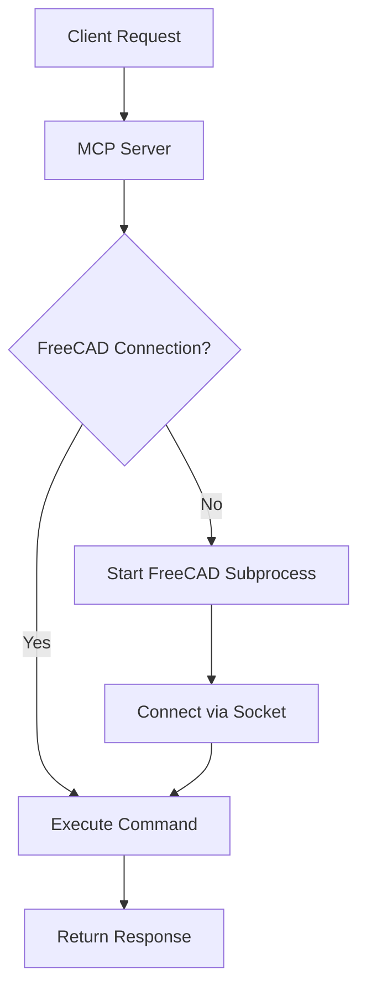

# FreeCAD Server Setup Guide

**Note:** This document describes the setup for the **Socket Server** connection method, which is **not the recommended approach** for most users. For the **most reliable connection**, we strongly recommend using the **Launcher method with an extracted FreeCAD AppImage**. Please see `docs/FREECAD_INTEGRATION.md` and `docs/PYTHON_INTERPRETER_SETUP.md` for details on the recommended setup.

This guide explains how to set up and manually run the `freecad_server.py` script *inside* FreeCAD, which allows the `FreeCADConnection` class (when configured to use the `server` method) to communicate with it via sockets.

## When to Use This Method?

- You prefer running a persistent FreeCAD instance in the background and managing the server script manually.
- The recommended AppImage/Launcher method is not suitable for your specific setup.
- You are debugging the socket communication layer itself.

## Requirements

1. FreeCAD (installed on the system or via extracted AppImage)
2. Python 3.6+ (the one used by your FreeCAD instance)
3. MCP-FreeCAD server code

## Setup Steps

### 1. Ensure FreeCAD is Accessible

If using a system install, ensure FreeCAD is properly installed. If using an AppImage, ensure it's downloaded (extraction is not strictly needed for this method, but recommended generally).

### 2. Server Files

Ensure that the `freecad_server.py` script from this repository is accessible by your FreeCAD instance.

## Starting the Server Manually within FreeCAD

Unlike the Launcher method, the Socket Server method requires you to **manually start the `freecad_server.py` script inside a running FreeCAD instance**.

### Option 1: Using the FreeCAD Python Console

1.  Launch FreeCAD (GUI or console mode).
2.  Open the Python console (View -> Panels -> Python console).
3.  Execute the server script:
    ```python
    # Make sure the path points to the script in your mcp-freecad project directory
    exec(open("/path/to/mcp-freecad/freecad_server.py").read())
    ```
    You should see output indicating the server is listening (e.g., `FreeCAD server listening on localhost:12345`).

### Option 2: Launching FreeCAD with the Server Script

You can start FreeCAD directly with the server script:

```bash
# Adjust path to your FreeCAD executable (system or AppImage)
/path/to/freecad -c /path/to/mcp-freecad/freecad_server.py --host 0.0.0.0 --port 12345
```

This starts FreeCAD in console mode and immediately runs the server script.

## Configuring MCP-FreeCAD to Use the Server Method

To make the main MCP server (`src/mcp_freecad/server/freecad_mcp_server.py`) connect to your manually started `freecad_server.py`, update your `config.json`:

```json
{
  "freecad": {
    "connection_method": "server",
    "host": "localhost",
    "port": 12345,
    "use_mock": false,
    "use_apprun": false
  }
}
```

Ensure the `host` and `port` match how you started `freecad_server.py`.

## Testing the Connection

1.  Start `freecad_server.py` inside FreeCAD using Option 1 or 2 above.
2.  Ensure your `config.json` is set to use `connection_method: server`.
3.  Start the main MCP server: `python src/mcp_freecad/server/freecad_mcp_server.py`.
4.  Check the output of `src/mcp_freecad/server/freecad_mcp_server.py`. It should log a successful connection to FreeCAD using the `server` method.

Alternatively, use the client:

```bash
# Run this AFTER starting freecad_server.py inside FreeCAD
# AND ensuring config.json is set to 'server' method
python freecad_client.py
```

If the client successfully connects, it will print: `Connected to FreeCAD using server method`. If it fails, it will print an error message.

## Client Usage Examples

The `freecad_client.py` script can be used to interact with the FreeCAD server:

```bash
# Get FreeCAD version
python freecad_client.py version

# Create a new document
python freecad_client.py create-document MyDocument

# Create a box
python freecad_client.py create-box --length 20 --width 15 --height 10 --document MyDocument

# Export the document to a STEP file
python freecad_client.py export-document --path model.step --document MyDocument
```

## Troubleshooting

### Connection Issues

If `src/mcp_freecad/server/freecad_mcp_server.py` or `freecad_client.py` cannot connect:

1.  **Verify `freecad_server.py` is running**: Check the FreeCAD console or the terminal where you launched it.
2.  **Check Host/Port**: Ensure the `host` and `port` in `config.json` match the address `freecad_server.py` is listening on.
3.  **Firewall**: Ensure no firewall is blocking the connection between the MCP server and FreeCAD (usually not an issue if running on the same machine).
4.  **FreeCAD Errors**: Look at the FreeCAD console output for any error messages from `freecad_server.py`.

## Advanced Configuration

You can create a `.freecad_server.json` file in your home directory to configure the FreeCAD server:

```json
{
  "host": "localhost",
  "port": 12345,
  "debug": true
}
```

Setting `debug` to `true` will enable more verbose logging in the FreeCAD console. 



---

*Reminder: Using the Launcher method with an extracted AppImage is generally more reliable and requires less manual setup.*
