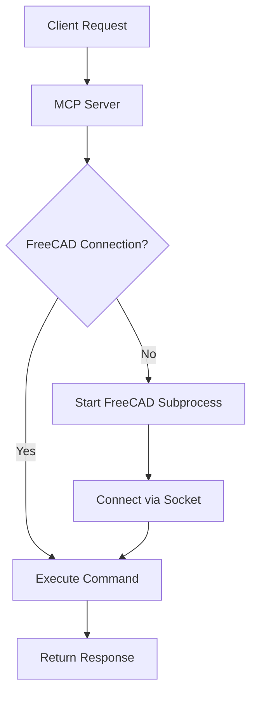

# FreeCAD Server Setup Guide

**Note:** This document describes the setup for the **Socket Server** connection method. For the **most reliable connection**, we strongly recommend using the **Launcher method with an extracted FreeCAD AppImage**. Please see `docs/FREECAD_INTEGRATION.md` and `docs/PYTHON_INTERPRETER_SETUP.md` for details on that recommended approach.

This guide explains how to set up and manually run the `freecad_server.py` script *inside* FreeCAD, which allows the `FreeCADConnection` class (using the `server` method) to communicate with it via sockets.

## When to Use This Method?

- You prefer running a persistent FreeCAD instance in the background.
- The recommended AppImage/Launcher method is not suitable for your specific setup.
- You are debugging the socket communication layer itself.

## Requirements

1. FreeCAD (installed on the system)
2. Python 3.6+ (included with FreeCAD)
3. MCP-FreeCAD server code

## Setup Steps

### 1. Install FreeCAD

Install FreeCAD on your system using your package manager or by downloading it from the [official website](https://www.freecad.org/downloads.php).

For Ubuntu/Debian:
```bash
sudo apt-get install freecad
```

For Fedora:
```bash
sudo dnf install freecad
```

For Arch Linux:
```bash
sudo pacman -S freecad
```

### 2. Configure MCP-FreeCAD

Update your `config.json` file to include the FreeCAD server settings:

```json
{
  "freecad": {
    "path": "/usr/bin/freecad",
    "server_port": 12345,
    "auto_connect": true,
    "reconnect_on_failure": true
  }
}
```

Make sure to set the correct path to your FreeCAD executable.

### 3. Server Files

Ensure that the `freecad_server.py` script is available and accessible by your FreeCAD instance.

## Starting the Server Manually within FreeCAD

Unlike the Launcher method, the Socket Server method requires you to **manually start the `freecad_server.py` script inside a running FreeCAD instance**.

### Option 1: Using the FreeCAD Python Console

1.  Launch FreeCAD (GUI or console mode).
2.  Open the Python console (View -> Panels -> Python console).
3.  Execute the server script:
    ```python
    # Make sure the path is correct
    exec(open("/path/to/mcp-freecad/freecad_server.py").read())
    ```
    You should see output indicating the server is listening (e.g., `FreeCAD server listening on localhost:12345`).

### Option 2: Launching FreeCAD with the Server Script

You can start FreeCAD directly with the server script:

```bash
# Adjust path to your FreeCAD executable if needed
freecad -c /path/to/mcp-freecad/freecad_server.py --host 0.0.0.0 --port 12345
```

This starts FreeCAD in console mode and immediately runs the server script.

## Configuring MCP-FreeCAD to Use the Server Method

To make the main MCP server connect to your manually started `freecad_server.py`, update your `config.json`:

```json
{
  "freecad": {
    "connection_method": "server",
    "host": "localhost",
    "port": 12345,
    "use_mock": false,
    "use_apprun": false
  }
}
```

Ensure the `host` and `port` match how you started `freecad_server.py`.

## Testing the Connection

To test that the FreeCAD server is running correctly, you can use the included client:

```bash
python freecad_client.py
```

If the client successfully connects to the FreeCAD server (either via the socket server, the bridge, or mock mode), it will print the connection method used:

```
Connected to FreeCAD using <method> method
```
(Where `<method>` will be `server`, `bridge`, or `mock`)

If it fails to connect, it will print an error message indicating the reason (e.g., connection refused, timeout, etc.).

## Client Usage Examples

The `freecad_client.py` script can be used to interact with the FreeCAD server:

```bash
# Get FreeCAD version
python freecad_client.py version

# Create a new document
python freecad_client.py create-document MyDocument

# Create a box
python freecad_client.py create-box --length 20 --width 15 --height 10 --document MyDocument

# Export the document to a STEP file
python freecad_client.py export-document --path model.step --document MyDocument
```

## Troubleshooting

### Connection Issues

If you're having trouble connecting to the FreeCAD server:

1. Make sure FreeCAD is installed and the path in `config.json` is correct
2. Check if another instance of the FreeCAD server is already running
3. Verify that port 12345 (or your configured port) is not in use by another application
4. Look at the FreeCAD console output for any error messages

### Crash Recovery

The MCP-FreeCAD integration includes a recovery mechanism that will automatically try to restart the FreeCAD server if it crashes or becomes unresponsive.

## Advanced Configuration

You can create a `.freecad_server.json` file in your home directory to configure the FreeCAD server:

```json
{
  "host": "localhost",
  "port": 12345,
  "debug": true
}
```

Setting `debug` to `true` will enable more verbose logging in the FreeCAD console. 


