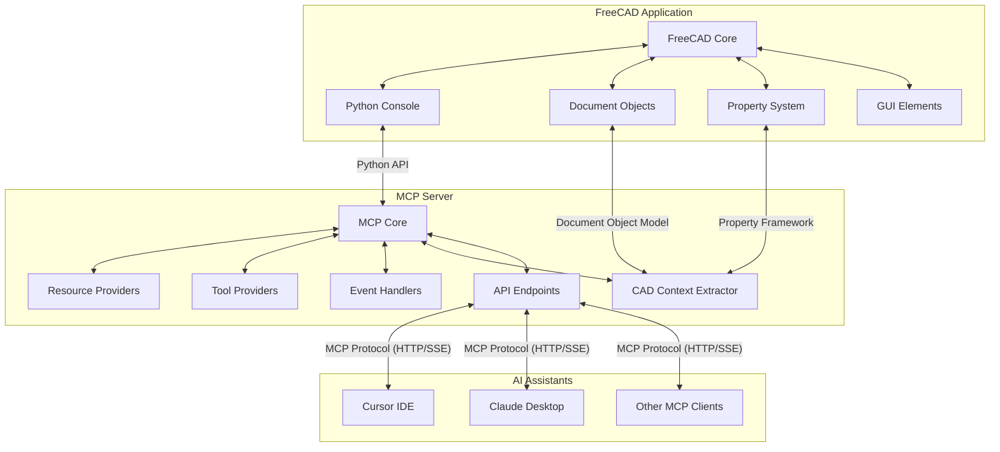

# Implementation Plan: MCP-FreeCAD Integration

## 1. Technical Architecture



### Data Flow Description:
1. **FreeCAD to MCP Server**: 
   - FreeCAD's Python API provides access to the document object model, property framework, and application state
   - The MCP server connects to FreeCAD through its Python API, either by direct import or through a socket connection
   - CAD Context Extractor processes FreeCAD objects into structured data suitable for AI consumption

2. **MCP Server to AI Assistants**:
   - MCP server exposes resources and tools via HTTP/SSE endpoints following the Model Context Protocol
   - Resources provide read-only access to CAD model data, properties, and metadata
   - Tools enable AI assistants to execute actions in FreeCAD (modify objects, run simulations, etc.)
   - Event handlers manage state changes and notifications between FreeCAD and AI assistants

3. **AI Assistants to MCP Server**:
   - AI assistants connect to the MCP server using the MCP client libraries
   - They can request resources to understand the CAD context
   - They can invoke tools to perform actions in FreeCAD
   - They receive events when the CAD model changes

## 2. Component Breakdown

### Core MCP Server Components

#### 1. MCP Core
- **Server Manager**: Initializes and manages the HTTP server, handles client connections
- **Protocol Handler**: Implements the MCP protocol specification
- **Authentication Manager**: Handles client authentication and session management
- **Configuration Manager**: Loads and manages server configuration

```python
# Example implementation of MCP Core
class MCPServer:
    def __init__(self, config_path="config.json"):
        self.config = self._load_config(config_path)
        self.resources = {}
        self.tools = {}
        self.event_handlers = {}
        self.auth_manager = AuthManager(self.config.get("auth", {}))
        
    def _load_config(self, config_path):
        with open(config_path, "r") as f:
            return json.load(f)
    
    def register_resource(self, resource_id, resource_provider):
        self.resources[resource_id] = resource_provider
        
    def register_tool(self, tool_id, tool_provider):
        self.tools[tool_id] = tool_provider
        
    def register_event_handler(self, event_type, handler):
        if event_type not in self.event_handlers:
            self.event_handlers[event_type] = []
        self.event_handlers[event_type].append(handler)
        
    def start(self, host="localhost", port=8080):
        # Initialize HTTP server with FastAPI
        app = FastAPI(title="FreeCAD MCP Server")
        
        # Register routes for MCP protocol
        app.add_api_route("/resources/{resource_id}", self.handle_resource_request, methods=["GET"])
        app.add_api_route("/tools/{tool_id}", self.handle_tool_request, methods=["POST"])
        app.add_api_route("/events", self.handle_events, methods=["GET"])
        
        # Start server
        uvicorn.run(app, host=host, port=port)
```

#### 2. Resource Providers
- **CAD Model Provider**: Exposes the current CAD model structure and properties
- **Document Provider**: Provides access to FreeCAD document metadata
- **Measurement Provider**: Offers dimensional and geometric measurements
- **Material Provider**: Exposes material properties and assignments
- **Constraint Provider**: Provides information about model constraints

```python
# Example Resource Provider for CAD Model
class CADModelResourceProvider:
    def __init__(self, freecad_app):
        self.app = freecad_app
        
    async def get_resource(self, uri, params=None):
        # Parse the URI to determine what information is being requested
        # Example URI: "cad://model/current/objects"
        parts = uri.split("/")
        
        if len(parts) < 4:
            raise ValueError(f"Invalid URI format: {uri}")
            
        if parts[3] == "objects":
            return self._get_objects()
        elif parts[3] == "tree":
            return self._get_object_tree()
        elif parts[3] == "selection":
            return self._get_selection()
        else:
            raise ValueError(f"Unknown resource: {parts[3]}")
    
    def _get_objects(self):
        # Get all objects in the active document
        doc = self.app.ActiveDocument
        if not doc:
            return {"objects": []}
            
        objects = []
        for obj in doc.Objects:
            objects.append({
                "id": obj.Name,
                "label": obj.Label,
                "type": obj.TypeId,
                "visibility": obj.Visibility,
                "properties": self._get_object_properties(obj)
            })
            
        return {"objects": objects}
    
    def _get_object_properties(self, obj):
        properties = {}
        for prop in obj.PropertiesList:
            try:
                prop_type = obj.getTypeIdOfProperty(prop)
                prop_value = getattr(obj, prop)
                
                # Convert complex types to serializable format
                if hasattr(prop_value, "__dict__"):
                    prop_value = str(prop_value)
                    
                properties[prop] = {
                    "type": prop_type,
                    "value": prop_value
                }
            except:
                # Skip properties that can't be serialized
                pass
                
        return properties
```

#### 3. Tool Providers
- **Model Manipulation Tools**: Create, modify, and delete CAD objects
- **Parametric Modeling Tools**: Adjust parameters and update models
- **Measurement Tools**: Calculate distances, areas, volumes
- **Code Generation Tools**: Generate FreeCAD Python scripts
- **Export/Import Tools**: Convert between file formats

```python
# Example Tool Provider for Model Manipulation
class ModelManipulationToolProvider:
    def __init__(self, freecad_app):
        self.app = freecad_app
        
    async def execute_tool(self, tool_id, params):
        if tool_id == "create_primitive":
            return self._create_primitive(params)
        elif tool_id == "modify_object":
            return self._modify_object(params)
        elif tool_id == "delete_object":
            return self._delete_object(params)
        else:
            raise ValueError(f"Unknown tool: {tool_id}")
    
    def _create_primitive(self, params):
        # Validate parameters
        if "type" not in params:
            raise ValueError("Missing required parameter: type")
            
        primitive_type = params["type"]
        doc = self.app.ActiveDocument
        
        if not doc:
            doc = self.app.newDocument("Unnamed")
            
        # Create the primitive based on type
        if primitive_type == "box":
            length = params.get("length", 10.0)
            width = params.get("width", 10.0)
            height = params.get("height", 10.0)
            
            box = doc.addObject("Part::Box", "Box")
            box.Length = length
            box.Width = width
            box.Height = height
            
            doc.recompute()
            return {"status": "success", "object_id": box.Name}
            
        elif primitive_type == "cylinder":
            radius = params.get("radius", 5.0)
            height = params.get("height", 10.0)
            
            cylinder = doc.addObject("Part::Cylinder", "Cylinder")
            cylinder.Radius = radius
            cylinder.Height = height
            
            doc.recompute()
            return {"status": "success", "object_id": cylinder.Name}
            
        # Add more primitive types as needed
        
        else:
            raise ValueError(f"Unsupported primitive type: {primitive_type}")
```

#### 4. Event Handlers
- **Document Change Handler**: Detects changes to the CAD model
- **Selection Change Handler**: Tracks user selection in the GUI
- **Command Execution Handler**: Monitors FreeCAD command execution
- **Error Handler**: Captures and reports errors

```python
# Example Event Handler for Document Changes
class DocumentChangeHandler:
    def __init__(self, mcp_server, freecad_app):
        self.server = mcp_server
        self.app = freecad_app
        self.connected_clients = set()
        
        # Register with FreeCAD's signal system
        self.app.signalDocumentChanged.connect(self._on_document_changed)
        
    def add_client(self, client_id):
        self.connected_clients.add(client_id)
        
    def remove_client(self, client_id):
        if client_id in self.connected_clients:
            self.connected_clients.remove(client_id)
            
    def _on_document_changed(self, doc):
        # Create event data
        event_data = {
            "type": "document_changed",
            "document": doc.Name,
            "timestamp": time.time(),
            "changes": self._detect_changes(doc)
        }
        
        # Notify all connected clients
        for client_id in self.connected_clients:
            asyncio.create_task(self._send_event(client_id, event_data))
            
    def _detect_changes(self, doc):
        # This would implement change detection logic
        # For simplicity, we're just returning basic info
        return {
            "objects_count": len(doc.Objects),
            "modified_objects": [obj.Name for obj in doc.Objects if obj.State]
        }
        
    async def _send_event(self, client_id, event_data):
        # This would use the MCP server's event sending mechanism
        await self.server.send_event(client_id, event_data)
```

#### 5. CAD Context Extractor
- **Object Hierarchy Analyzer**: Extracts the hierarchical structure of CAD models
- **Geometric Feature Extractor**: Identifies and categorizes geometric features
- **Semantic Relationship Analyzer**: Determines relationships between objects
- **Metadata Extractor**: Gathers annotations, dimensions, and other metadata
- **Code Context Extractor**: Analyzes Python code in the FreeCAD environment

```python
# Example CAD Context Extractor
class CADContextExtractor:
    def __init__(self, freecad_app):
        self.app = freecad_app
        
    def extract_full_context(self):
        """Extract comprehensive context from the current FreeCAD state"""
        context = {
            "application": self._extract_application_context(),
            "documents": self._extract_documents_context(),
            "active_document": self._extract_active_document_context(),
            "selection": self._extract_selection_context(),
            "python_console": self._extract_python_console_context()
        }
        return context
        
    def _extract_application_context(self):
        """Extract information about the FreeCAD application"""
        return {
            "version": self.app.Version,
            "build_type": self.app.BuildVersionMajor,
            "operating_system": platform.system(),
            "available_workbenches": list(self.app.getWorkbenches().keys())
        }
        
    def _extract_documents_context(self):
        """Extract information about all open documents"""
        docs = []
        for doc_name in self.app.listDocuments():
            doc = self.app.getDocument(doc_name)
            docs.append({
                "name": doc.Name,
                "label": doc.Label,
                "file": doc.FileName if hasattr(doc, "FileName") else None,
                "objects_count": len(doc.Objects),
                "modified": doc.Modified
            })
        return docs
        
    def _extract_active_document_context(self):
        """Extract detailed information about the active document"""
        doc = self.app.ActiveDocument
        if not doc:
            return None
            
        return {
            "name": doc.Name,
            "label": doc.Label,
            "file": doc.FileName if hasattr(doc, "FileName") else None,
            "objects": self._extract_objects_context(doc),
            "object_hierarchy": self._extract_object_hierarchy(doc),
            "dependencies": self._extract_dependencies(doc)
        }
        
    def _extract_objects_context(self, doc):
        """Extract information about all objects in a document"""
        objects = []
        for obj in doc.Objects:
            objects.append({
                "id": obj.Name,
                "label": obj.Label,
                "type": obj.TypeId,
                "visibility": obj.Visibility,
                "properties": self._extract_object_properties(obj),
                "geometry": self._extract_object_geometry(obj)
            })
        return objects
```

#### 6. API Endpoints
- **Resource Endpoint**: Handles resource requests from clients
- **Tool Endpoint**: Processes tool execution requests
- **Event Endpoint**: Manages Server-Sent Events (SSE) for real-time updates
- **Schema Endpoint**: Provides schema information for resources and tools
- **Health Endpoint**: Reports server status and diagnostics

## 3. Development Roadmap

### Phase 1: Foundation (Weeks 1-2)
**Milestone**: Basic MCP server with FreeCAD connectivity

**Tasks**:
- Set up project structure and development environment
- Implement core MCP server with HTTP/SSE support
- Create basic FreeCAD connectivity module
- Develop simple resource providers for CAD model access
- Implement authentication and security foundation

**Acceptance Criteria**:
- MCP server starts and connects to FreeCAD
- Basic CAD model structure can be accessed via MCP resources
- Authentication system validates client connections
- Documentation for initial setup is complete

### Phase 2: Resource Providers (Weeks 3-4)
**Milestone**: Comprehensive resource providers for CAD context

**Tasks**:
- Implement CAD Model Provider with full object hierarchy
- Develop Document Provider for metadata access
- Create Measurement Provider for dimensional data
- Implement Material Provider for material properties
- Develop Constraint Provider for model constraints
- Create comprehensive context extraction algorithms

**Acceptance Criteria**:
- All resource providers return valid data in MCP format
- Context extraction captures complete CAD model state
- Resource providers handle edge cases (empty documents, complex objects)
- Unit tests cover all resource providers

### Phase 3: Tool Providers (Weeks 5-6)
**Milestone**: Interactive tools for CAD manipulation

**Tasks**:
- Implement Model Manipulation Tools for creating and modifying objects
- Develop Parametric Modeling Tools for parameter adjustments
- Create Measurement Tools for geometric calculations
- Implement Code Generation Tools for Python script creation
- Develop Export/Import Tools for file format conversion

**Acceptance Criteria**:
- All tools execute successfully in FreeCAD
- Tools handle parameter validation and error cases
- Changes made by tools are reflected in the CAD model
- Generated code executes correctly in FreeCAD

### Phase 4: Event System (Weeks 7-8)
**Milestone**: Real-time event notification system

**Tasks**:
- Implement Document Change Handler for model updates
- Develop Selection Change Handler for user interaction
- Create Command Execution Handler for operation tracking
- Implement Error Handler for exception reporting
- Develop event filtering and subscription system

**Acceptance Criteria**:
- Events are triggered correctly when CAD model changes
- Clients receive real-time notifications via SSE
- Event system handles multiple concurrent clients
- Event handlers properly clean up resources

### Phase 5: Integration and Optimization (Weeks 9-10)
**Milestone**: Fully integrated and optimized system

**Tasks**:
- Integrate all components into cohesive system
- Optimize performance for large CAD models
- Implement caching strategies for resource providers
- Develop connection recovery mechanisms
- Create comprehensive logging and diagnostics

**Acceptance Criteria**:
- System handles large CAD models efficiently
- Resource caching improves response times
- Connection interruptions are handled gracefully
- Logging provides clear diagnostic information

### Phase 6: Testing and Documentation (Weeks 11-12)
**Milestone**: Production-ready system with documentation

**Tasks**:
- Develop comprehensive test suite (unit, integration, system)
- Create user documentation with examples
- Develop developer documentation with API references
- Implement example clients for demonstration
- Create installation and configuration guides

**Acceptance Criteria**:
- Test coverage exceeds 80% for all components
- Documentation covers all features and APIs
- Example clients demonstrate key capabilities
- Installation process is documented and tested

## 4. Tech Stack Selection

### Core Technologies

| Component | Technology | Justification |
|-----------|------------|---------------|
| **Programming Language** | Python 3.8+ | Compatible with FreeCAD's Python API, extensive library support, and easy integration with AI systems |
| **HTTP Server** | FastAPI | High performance, async support, automatic OpenAPI documentation, and type checking |
| **Event Handling** | Server-Sent Events (SSE) | Lightweight, HTTP-based protocol for real-time events that works through firewalls |
| **Serialization** | JSON/MessagePack | Standard formats for data exchange, with MessagePack for binary efficiency |
| **Authentication** | JWT (JSON Web Tokens) | Stateless authentication that scales well for distributed systems |
| **Testing** | pytest | Comprehensive testing framework with good fixture support |
| **Documentation** | MkDocs with Material theme | Modern documentation system with good code integration |

### Dependencies

| Dependency | Purpose | Justification |
|------------|---------|---------------|
| **pydantic** | Data validation and settings management | Type safety and automatic validation of complex data structures |
| **uvicorn** | ASGI server | High-performance server for FastAPI |
| **numpy** | Numerical computations | Essential for geometric calculations and transformations |
| **networkx** | Graph operations | Useful for analyzing object hierarchies and dependencies |
| **loguru** | Logging | Enhanced logging capabilities with better formatting |
| **typer** | CLI interface | Build command-line interfaces with type annotations |
| **python-jose** | JWT implementation | Secure implementation of JWT for authentication |
| **aiofiles** | Async file operations | Non-blocking file I/O for better performance |

### Minimal Dependencies Philosophy

The tech stack is designed with a "minimal dependencies" approach:
- Core dependencies are limited to well-maintained, stable libraries
- Optional features can be enabled with additional dependencies
- Native Python implementations are preferred where possible
- Dependencies with binary extensions are avoided when alternatives exist
- All dependencies are pinned to specific versions for reproducibility

## 5. API Endpoint Specifications

### Resource Endpoints

#### GET /resources/{resource_id}
Retrieves a resource from the MCP server.

**Parameters**:
- `resource_id`: Identifier for the resource
- Query parameters specific to the resource type

**Response**:
```json
{
  "resource_id": "cad_model",
  "mime_type": "application/json",
  "data": {
    "objects": [
      {
        "id": "Box001",
        "type": "Part::Box",
        "properties": {
          "Length": {"type": "App::PropertyLength", "value": 10.0},
          "Width": {"type": "App::PropertyLength", "value": 10.0},
          "Height": {"type": "App::PropertyLength", "value": 10.0}
        }
      }
    ]
  }
}
```

#### Resource URI Scheme

The MCP server will use a URI scheme for addressing resources:

- `cad://model/{document_name}/objects` - All objects in a document
- `cad://model/{document_name}/object/{object_name}` - Specific object
- `cad://model/{document_name}/selection` - Currently selected objects
- `cad://model/{document_name}/features/{feature_type}` - Objects with specific features
- `cad://code/history` - Python code history from console
- `cad://code/snippets/{snippet_id}` - Stored code snippets
- `cad://measurements/{measurement_type}` - Measurement results

### Tool Endpoints

#### POST /tools/{tool_id}
Executes a tool on the MCP server.

**Parameters**:
- `tool_id`: Identifier for the tool
- Request body: Tool-specific parameters

**Request Body Example**:
```json
{
  "parameters": {
    "type": "box",
    "length": 20.0,
    "width": 15.0,
    "height": 10.0
  }
}
```

**Response**:
```json
{
  "tool_id": "create_primitive",
  "status": "success",
  "result": {
    "object_id": "Box002",
    "properties": {
      "Length": 20.0,
      "Width": 15.0,
      "Height": 10.0
    }
  }
}
```

#### Tool Categories

The MCP server will provide tools in the following categories:

1. **Creation Tools**
   - `create_primitive` - Create primitive shapes
   - `create_sketch` - Create 2D sketches
   - `create_extrusion` - Create extrusions from sketches
   - `create_revolution` - Create revolutions from sketches

2. **Modification Tools**
   - `modify_object` - Change object properties
   - `transform_object` - Move, rotate, scale objects
   - `boolean_operation` - Perform boolean operations
   - `fillet_edge` - Create fillets on edges

3. **Query Tools**
   - `measure_distance` - Measure distance between entities
   - `calculate_volume` - Calculate volume of objects
   - `analyze_topology` - Analyze topological properties
   - `check_interference` - Check for interference between objects

4. **Code Tools**
   - `generate_script` - Generate Python script for operations
   - `execute_script` - Execute Python code in FreeCAD
   - `save_snippet` - Save code snippet for later use
   - `load_snippet` - Load saved code snippet

### Event Endpoints

#### GET /events
Establishes an SSE connection for receiving events.

**Parameters**:
- Query parameters for filtering events

**Event Format**:
```
event: document_changed
data: {"document": "Unnamed", "objects": ["Box001"], "timestamp": 1616161616}

event: selection_changed
data: {"selected": ["Box001"], "deselected": [], "timestamp": 1616161620}
```

## 6. Context Extraction Algorithms

### Object Hierarchy Extraction

The CAD context extractor will use a multi-level approach to extract the hierarchical structure of CAD models:

1. **Document Level**
   - Extract document metadata (name, label, file path)
   - Identify document properties and units
   - Capture view settings and display modes

2. **Object Level**
   - Extract object metadata (name, label, type)
   - Identify object properties and values
   - Capture visibility and selection state
   - Determine parent-child relationships

3. **Feature Level**
   - Extract feature metadata (type, parameters)
   - Identify feature dependencies
   - Capture construction history

4. **Geometry Level**
   - Extract geometric data (vertices, edges, faces)
   - Identify geometric constraints
   - Capture dimensional constraints

```python
def extract_object_hierarchy(doc):
    """Extract the hierarchical structure of objects in a document"""
    hierarchy = {}
    
    # Create a dictionary of all objects
    all_objects = {obj.Name: {
        "label": obj.Label,
        "type": obj.TypeId,
        "children": []
    } for obj in doc.Objects}
    
    # Identify parent-child relationships
    for obj in doc.Objects:
        # Check for Group property (used by many container objects)
        if hasattr(obj, "Group") and obj.Group:
            for child in obj.Group:
                if child.Name in all_objects:
                    all_objects[obj.Name]["children"].append(child.Name)
        
        # Check for OutList/InList relationships
        if hasattr(obj, "OutList") and obj.OutList:
            for outObj in obj.OutList:
                if outObj.Name in all_objects:
                    # This indicates obj depends on outObj
                    pass
                    
    # Build the root level (objects with no parents)
    root_objects = []
    for obj_name, obj_data in all_objects.items():
        is_child = False
        for other_obj in all_objects.values():
            if obj_name in other_obj["children"]:
                is_child = True
                break
                
        if not is_child:
            root_objects.append(obj_name)
            
    # Build the final hierarchy
    hierarchy = {
        "root": root_objects,
        "objects": all_objects
    }
    
    return hierarchy
```

### Geometric Feature Extraction

The geometric feature extractor will identify and categorize geometric features:

1. **Primitive Recognition**
   - Identify basic shapes (box, cylinder, sphere, etc.)
   - Extract dimensional parameters
   - Recognize orientation and position

2. **Feature Recognition**
   - Identify common features (holes, fillets, chamfers, etc.)
   - Extract feature parameters
   - Recognize feature purpose (functional vs. aesthetic)

3. **Pattern Recognition**
   - Identify repeated features and patterns
   - Extract pattern parameters (count, spacing, direction)
   - Recognize symmetry and mirroring

## 7. Security Considerations

### Authentication and Authorization

1. **Local Development Environment**
   - Use API keys for authentication in local development
   - Implement token-based authentication for more secure environments
   - Support for JWT (JSON Web Tokens) for stateless authentication

2. **Access Control**
   - Implement role-based access control for different operations
   - Restrict access to sensitive operations (e.g., file system access)
   - Provide read-only mode for viewing CAD models without modification rights

3. **Input Validation**
   - Validate all input parameters to prevent injection attacks
   - Sanitize file paths to prevent directory traversal
   - Implement rate limiting to prevent abuse

### Data Protection

1. **Local Data Storage**
   - Store sensitive data (e.g., API keys) in secure configuration files
   - Use environment variables for secrets in development
   - Implement secure storage for persistent data

2. **Communication Security**
   - Use HTTPS for all communication with remote clients
   - Implement proper SSL/TLS configuration
   - Support for secure WebSockets for real-time communication

3. **Error Handling**
   - Implement proper error handling to prevent information leakage
   - Log security-related events for audit purposes
   - Provide generic error messages to users while logging detailed information

## 8. Performance Optimization Strategies

### Large CAD Model Handling

1. **Lazy Loading**
   - Implement lazy loading of CAD model components
   - Load only necessary parts of the model on demand
   - Use pagination for large collections of objects

2. **Caching**
   - Cache frequently accessed resources
   - Implement cache invalidation on model changes
   - Use memory-efficient caching strategies for large models

3. **Compression**
   - Compress large data transfers
   - Use binary formats (MessagePack) for efficient serialization
   - Implement delta updates for incremental changes

### Asynchronous Processing

1. **Non-blocking I/O**
   - Use asynchronous I/O for file operations
   - Implement non-blocking API for long-running operations
   - Provide progress updates for time-consuming tasks

2. **Background Processing**
   - Execute computationally intensive tasks in background threads
   - Implement job queues for processing tasks
   - Provide notification when background tasks complete

3. **Resource Management**
   - Implement proper resource cleanup
   - Monitor memory usage for large operations
   - Implement timeouts for long-running operations

## 9. Testing Framework

### Unit Testing

1. **Component Tests**
   - Test individual components in isolation
   - Mock dependencies for controlled testing
   - Verify component behavior against specifications

2. **API Tests**
   - Test API endpoints for correct behavior
   - Verify request/response formats
   - Test error handling and edge cases

3. **Integration Tests**
   - Test interaction between components
   - Verify end-to-end workflows
   - Test with real FreeCAD instances

### Performance Testing

1. **Load Testing**
   - Test system under various load conditions
   - Measure response times and resource usage
   - Identify bottlenecks and optimization opportunities

2. **Stress Testing**
   - Test system under extreme conditions
   - Verify system stability under high load
   - Test recovery from failure conditions

3. **Benchmarking**
   - Establish performance baselines
   - Compare performance across different configurations
   - Track performance changes over time

### Validation Testing

1. **Context Validation**
   - Verify accuracy of extracted context
   - Compare extracted data with actual FreeCAD state
   - Test with various CAD models and configurations

2. **Tool Validation**
   - Verify tool execution results
   - Compare tool output with expected results
   - Test with various input parameters

## 10. Documentation Requirements

### Developer Documentation

1. **API Reference**
   - Document all API endpoints
   - Provide request/response examples
   - Document error codes and handling

2. **Architecture Overview**
   - Document system architecture
   - Explain component interactions
   - Provide diagrams and flowcharts

3. **Development Guide**
   - Document development environment setup
   - Provide coding standards and guidelines
   - Document build and deployment processes

### User Documentation

1. **Installation Guide**
   - Document installation process
   - List system requirements
   - Provide troubleshooting information

2. **User Guide**
   - Document basic usage
   - Provide examples for common tasks
   - Include screenshots and diagrams

3. **Tutorial**
   - Provide step-by-step tutorials
   - Cover basic to advanced usage
   - Include example projects